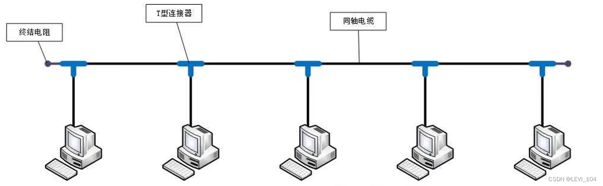
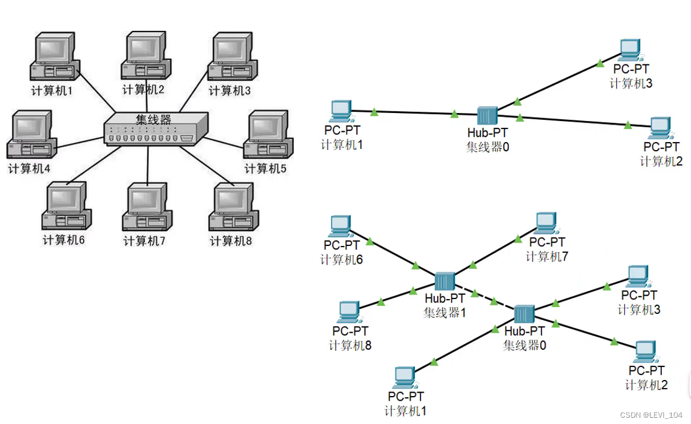
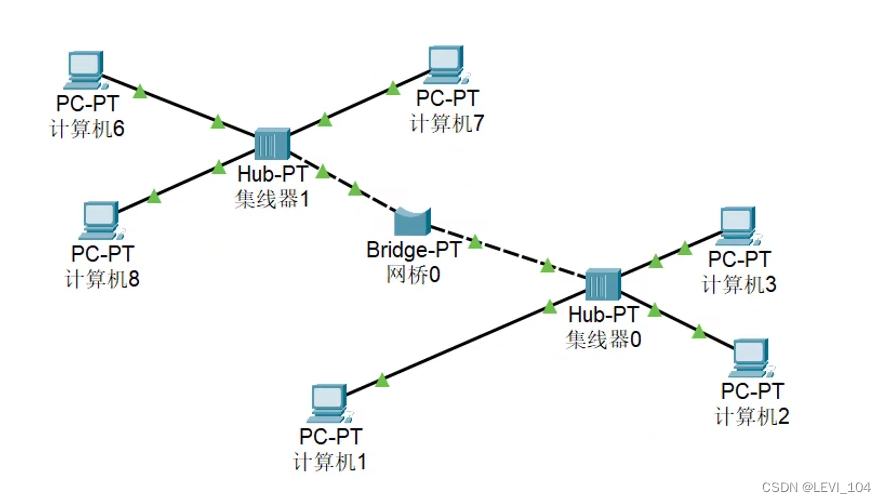
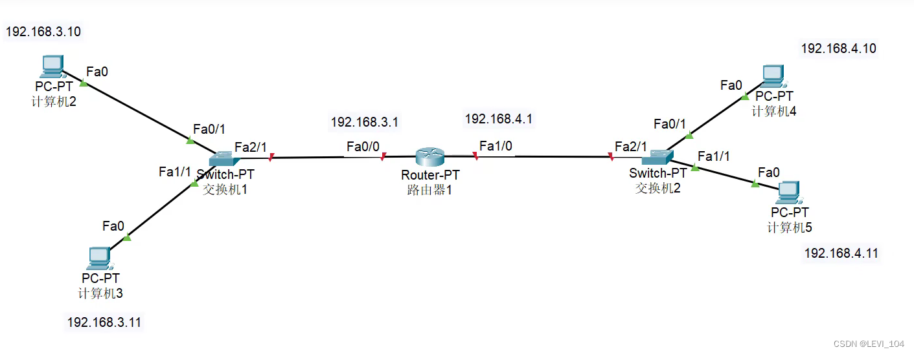

## Connection mode of computer

### coaxial cable

characteristic：Half-duplex communication，easy-conflict，not secure，中间断了，整个瘫痪 

### Hub

characteristic：Half-duplex communication，easy-conflict，not secure

### Bridge

characteristic：The MAC address of each interface can be learned by self-learning to isolate conflict domains

### Switch

 characteristic：It's like a bridge with more interfaces，Full-Duplex Communication，secure

### Router

- direct network cable，coaxial cable，Hub，bridge，switch，the connected devices who use them must be on the same network segment and in the same broadcast domain.

 characteristic：Data can be forwarded on different network segments，Isolated broadcast domain