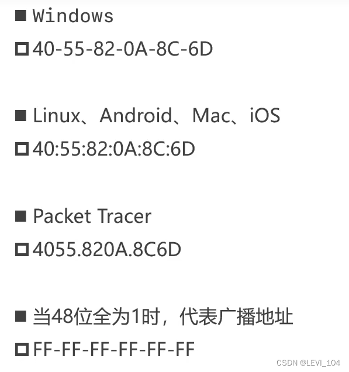

## MAC地址

- Each NIC has a six-byte (48-bit) MAC address
- Unique in the world, solidified in the ROM of the NIC, by the IEEE802 standard

## 

- First three bytes: OUI (Organization Unique Identifier), which is assigned to the vendor by the registrar of IEEE
- Last three bytes: allocated by the vendor

### MAC地址的表示格式

###  ＭＡＣ地址操作

### ARP协议获得MAC地址

Two machines need IP addresses and MAC addresses to communicate with each other，如下：

如果一开始两台机器没有在命令行中进行ping操作，是无法进行ICMP的，因为缺少MAC。

此时发送请求的机器就会进行ARP协议发送广播给所有连接的设备，告诉那些设备要寻找MAC的ip地址

> 
>
> FFFF.FFFF.FFF就是广播，在计算机中是一堆1。

然后所有的设备进行检查，当一个设备发现寻找的ip地址就是自己时，就会将MAC返回到原来的机器。

这样，有ip又有MAC，之后就可以进行ICMP协议ping通