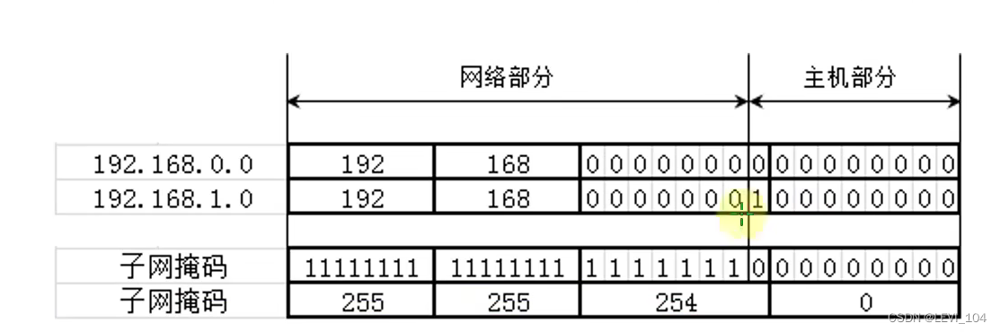
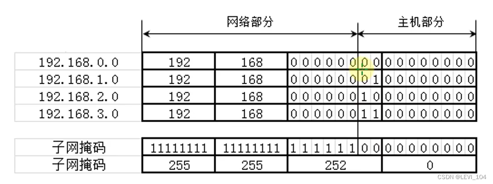

## supernetting

supernetting：In contrast to a subnet, it combines multiple contiguous network segments into one larger network segment

> example:
>
> request: originally it had 200 computers using the 192.168.0.0/24 network segment, and now hopes to add 200 devices to the same network segment
>
> Solution :200 PCs in the 192.168.0.0/24 network segment, 200 PCs in the 192.168.1.0/24 network segment. Merging 192.168.0.0/24 and 192.168.1.0/24 into one network segment: 192.168.0.0/23 (Move the subnet mask one bit to the left)

Merging four network segments to form a supernetting.

