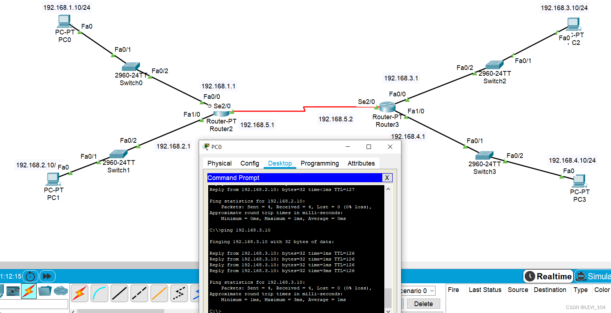

## Static routing 

If u want to forward data between different segments, u need to use a router.

By default, the router only knows the network segment to which it is directly connected.The network segment that is not directly connected needs to be informed to the router through static or dynamic routers.

- static routing：The administrator manually adds router information for small-scale networks.
- dynamic routing：A router automatically obtains routing information by routing protocols, such as RIP and OSPF. Dynamic routing is applicable to large-scale networks.

attention：PC01到PC02路由器跳转、PC02到PC01路由器跳转都需要配置静态路由表，please remember to open their ports.