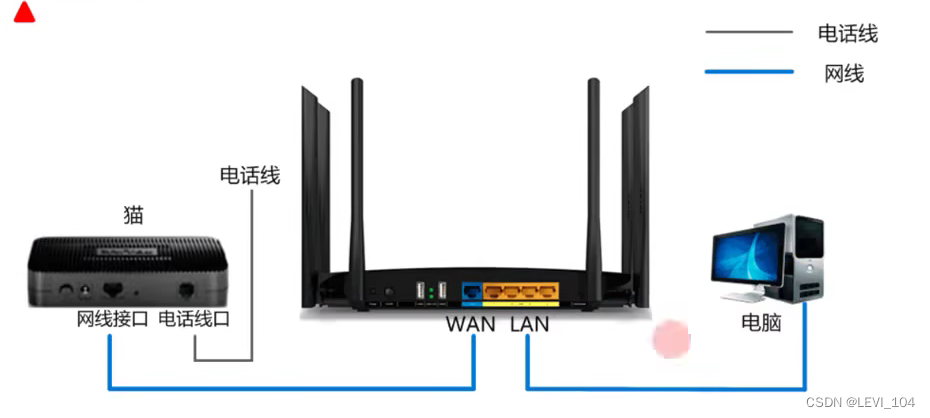
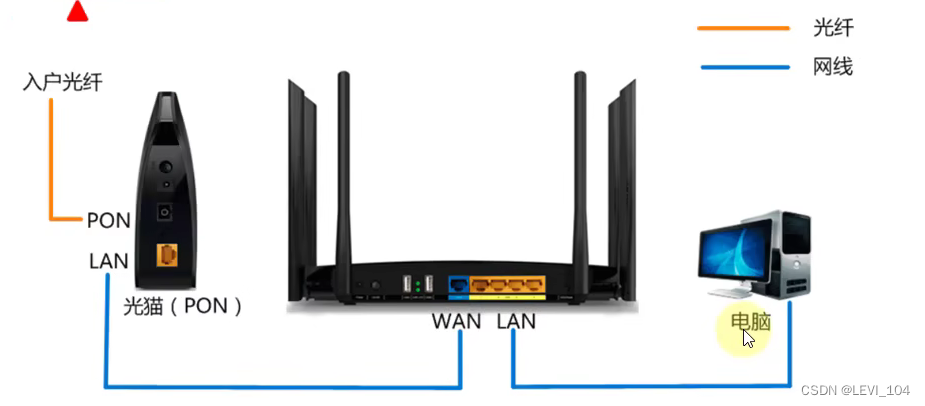
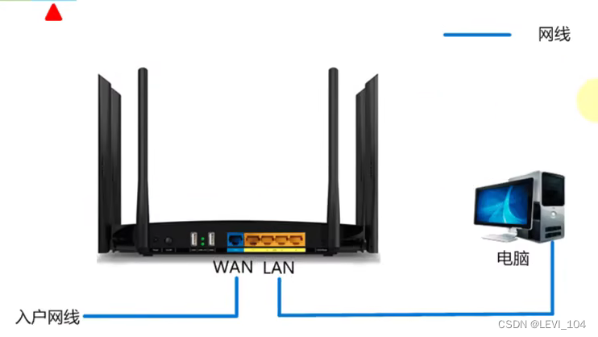
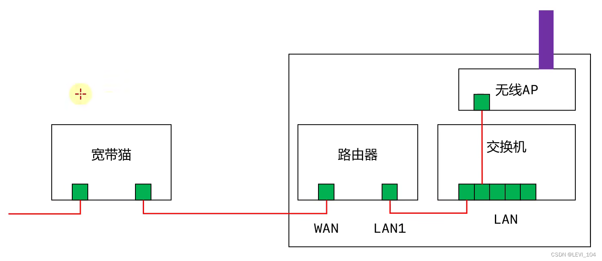

## 上网方式

### 电话线入户

 ADSL电话拨号上网（Asymmertric Digital Subscriber Line），provides asymmetric uplink and downlink transmission bandwidth.

猫（Modem）：调制解调器，it converts analog signals into digital ones.

### 光纤入户

 光猫（Optical Modem）：光调制解调器，it converts optical signals into digital ones.

### 网线入户

##  家用无线路由器的逻辑结构

