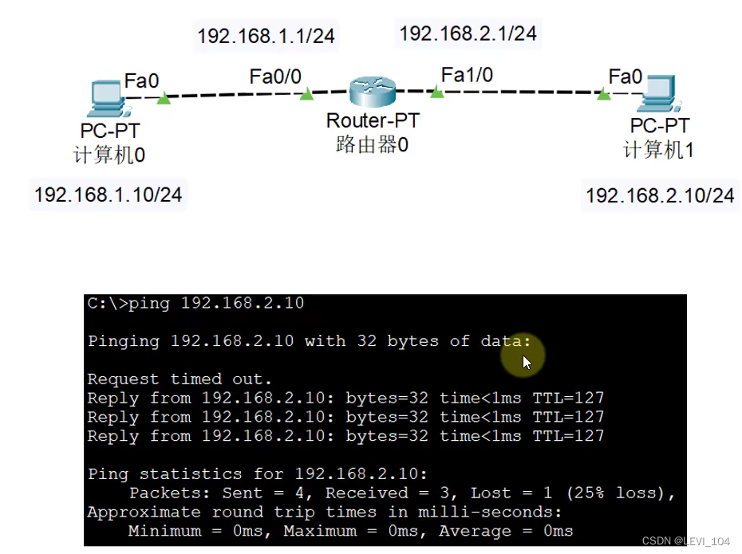
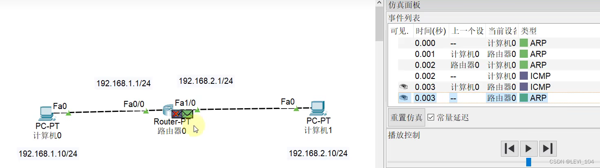

## ping时丢失第一个包

reason：When the data packet is arrived at Fa1/0，there is no PC01's MAC address.So the router 0 abandons this data packet，and router 0 will make a ARP request to search for PC01's MAC address.