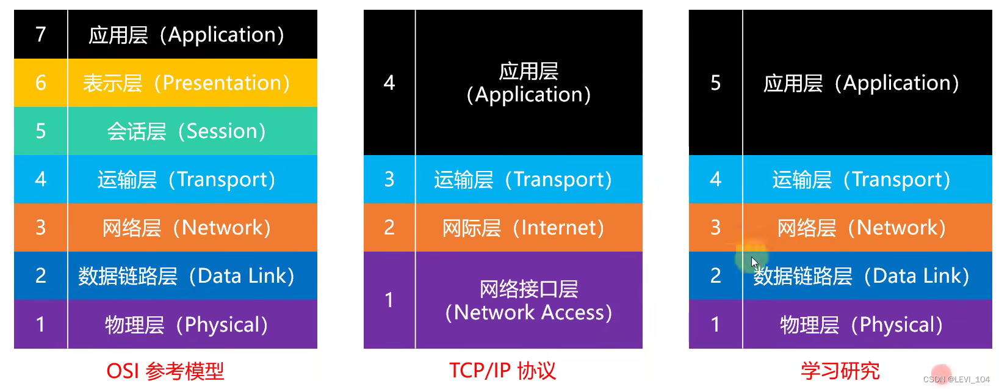
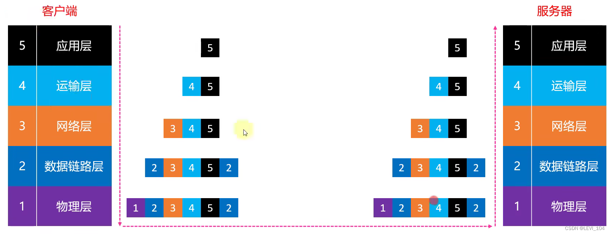
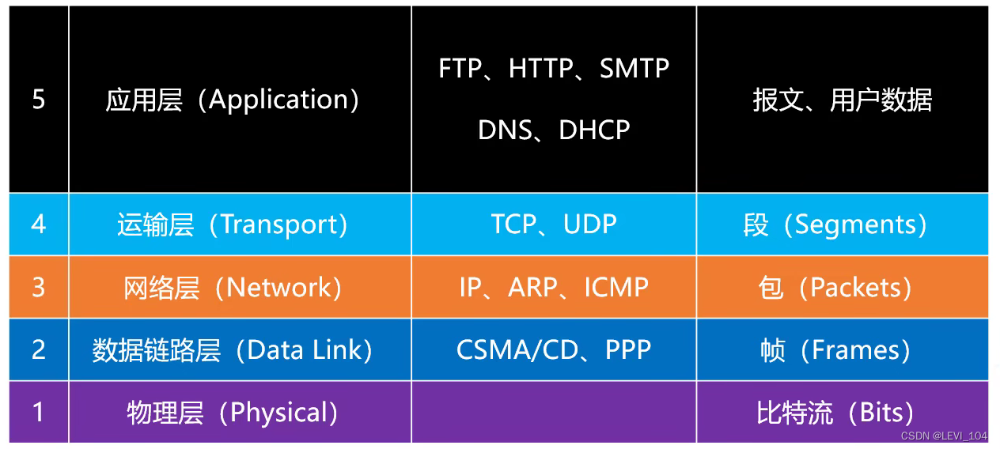

#  网络互联模型

In order to better promote the research and development of the Internet, the International Organization for Standardization (ISO) formulated the network interconnection Model in 1985, and the OSI System Interconnect Reference Model (Poen System Interconnect Reference Model) has a seven-layer structure. 

##  请求过程

##  网络分层

