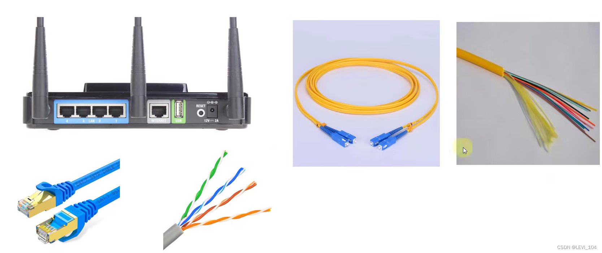
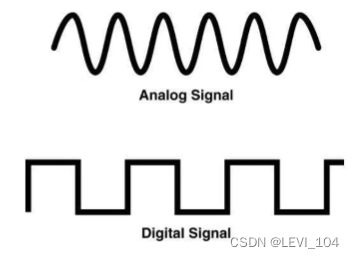
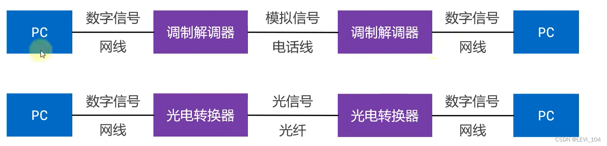

#  物理层（Physical）

The Physical defines the standard of interface,cable，transmission rate，transmission way, etc.

# 

##  数字信号、模拟信号

- Analog Signal：Continuous signal, suitable for long distance transmission. Poor anti-interference ability, waveform deformation is difficult to correct when interference appears.
- Digital Signal：Discrete signals, not suitable for long-distance transmission. Strong anti-interference ability, waveform distortion can be recovered when interference appears.

## 数据通信模型

LAN communication model

WAN communication model

##  信道（Channel)

Channel：The channel where information is transmitted. A transmission medium, such as a network cable, may be composed of several channels.

- Simplex communication：The signal can only be transmitted in one direction, and the transmission direction of the signal can not be changed. Such as radio broadcast and cable television broadcast.
- Half duplex communication：Signal can be bidirectionally transmitted, but must be alternating, at the same time it can only be transmitted in one direction. Such as: intercom
- Full duplex communication：Signal can be bidirectionally transmitted at the same time . Such as : call a phone.