#  数据链路层（Data Link）

Data Link：A physical line (wired or wireless) from one node to its neighbors, with no other exchangeable nodes in between.

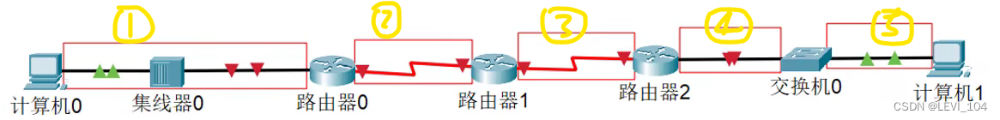

>  explanation：1是同一个链路，集线器无脑，2是一个链路，3是一个链路，4是一个链路，5是一个链路。不过4和5的数据是相同的

When transmitting data in a data link, it needs a corresponding protocol to control the transmission of data.

The communication protocol may be different in different types of data link.

- boardcast data link：CSMA/CD protocol，such as :a network consists of coaxial cable and Hub （or router - switch - router）
- peer to peer data link：PPP protocol，such as : a network between two routers.

three basical problems in data link：封装成帧（*framing）*，透明传输(transparent transmission)，差错检验(error check)

## 数据链路层的三个基本问题

###  封装成帧

Frame's data part is the IP data packet transmitted from the network layer.

MTU（Maximum Transfer Unit），every data link's protorol stipulates frame's maximum length of data to be sent，Ethernet's MTU is 1500 bytes.

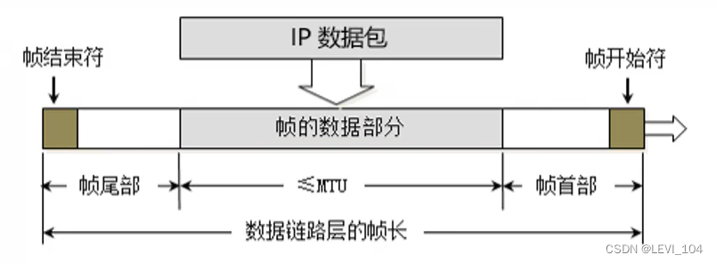

###  透明传输

 using SHO（Start Of Header）as the beginning symbol of frame，EOT（End Of Transmission）as the ending symbol of frame.

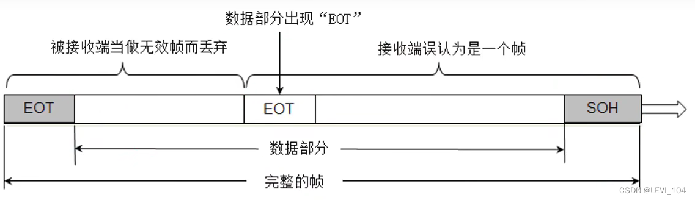

 If SOH and EOT appears in the data part, it must make a escape.

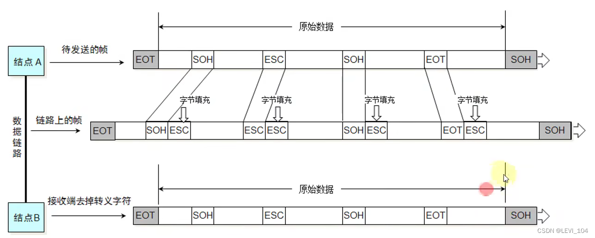

###  差错检验

FCS is calculated by data part and beginning part.

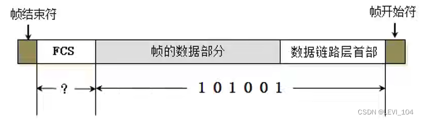

###  CSMA／CD协议

CSMA/CD（Carrier Sense Multiple Access with Collision Detection），载波侦听多路访问／冲突检测

The network which uses this protocol is called Ethernet，it transmits Ethernet frame. Ethernet frame's standard：Ethernet V2，IEEE-802.3。Ethernet V2 is widely used.

In order to detect whether the frame that is being sent makes a conflict , the Ethernet frame needs 64 bytes at least.

The network using Switch is already support Full duplex communication. It doesn't need use CSMA/CD protocol, but its frame is still Ethernet frame.

### Ethernet V2帧的格式

- Beginning：source MAC　＋　target MAC　＋　network type
- Ethernet frame：beginning part　＋ data + FCS
- data's length at least：64 - 6 - 6 - 2 - 4 = 46 bytes

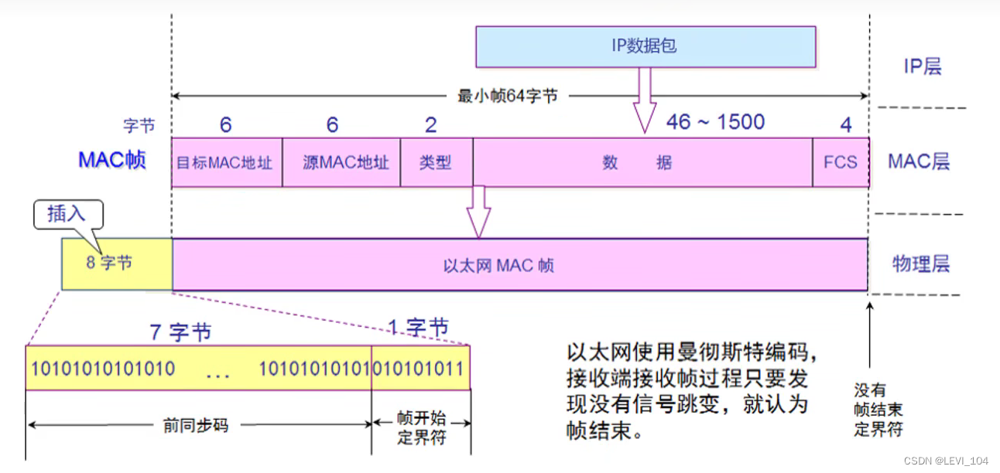

When data part's length less than 46 bytes, the data link layer will add some bytes behind the data , the receive port will abandon this adding bytes.

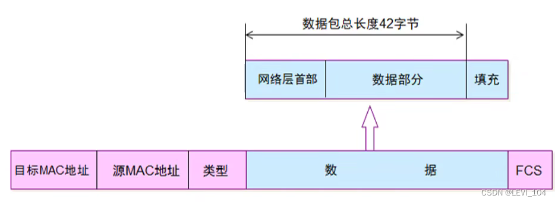

 summary：Ethernet frame's data length：46~1500 bytes，Ethernet frame's length ：64~1518 bytes（target MAC + source MAC + network type + data + FCS）

###  PPP协议

- Address：the value in picture is 0xFF，it is valueless, peer to peer channel doesn't need source MAC and target MAC
- Control：the value in picture is 0x03，it is valueless up to now
- Protocol：the protocol type used inside 
- beginning and ending symbol of frame：0x7E

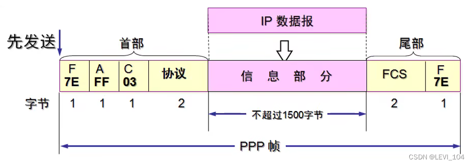

 0x7E--->0x7D5E，0x7D----->0x7D5D

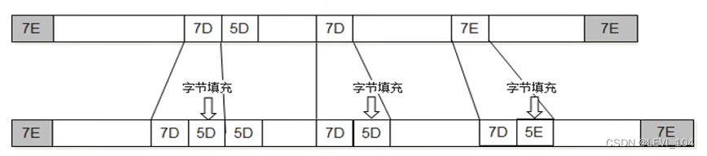

###  网卡

- When the NIC receives a frame, it first checks the error. If the frame passes the check, it receives this frame; otherwise, it discards it.
- The frame catched by Wireshark lacks of FCS: Because the frame that Wireshark catchs is the frame which passed the error check.(FCS will be discarded by hardware)
- Wireshark cann't catch the frame which doesn't pass error check.

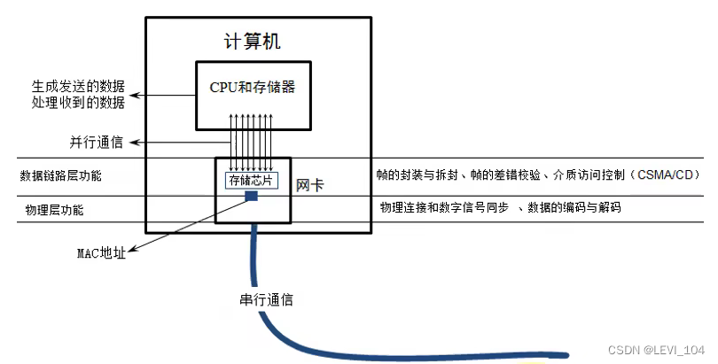

 this is Wireshark

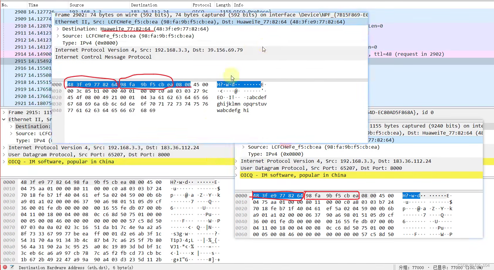