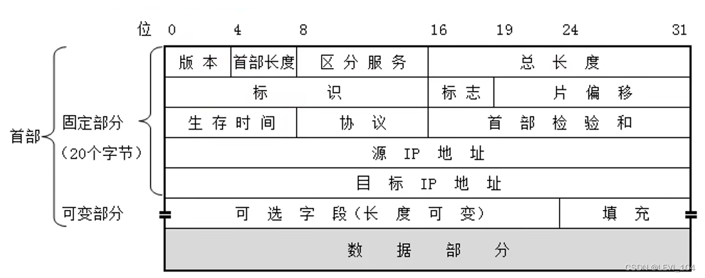
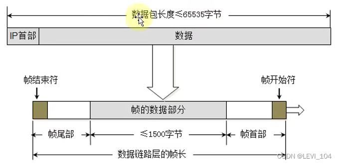
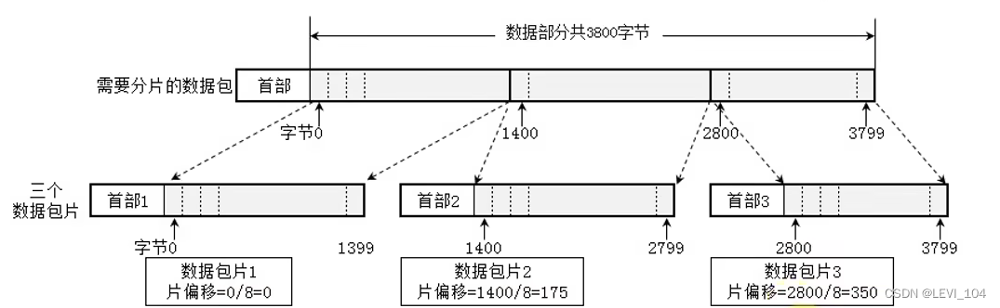
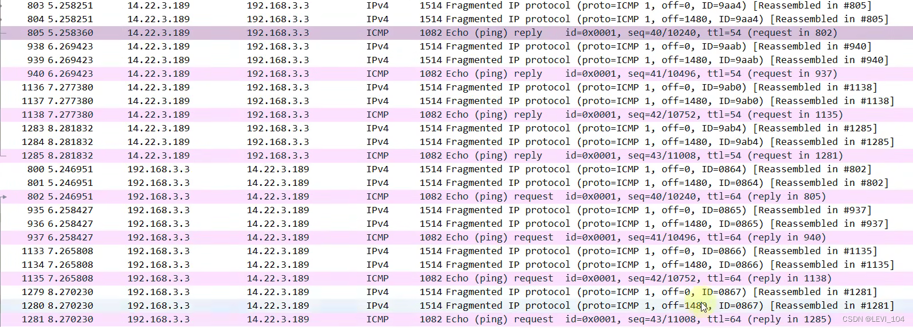
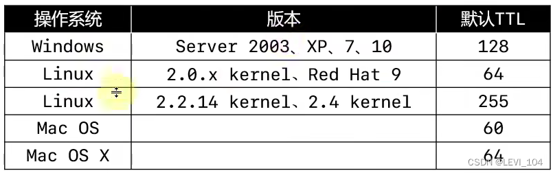

# 网络层

网络层数据包（IP数据包，Packet）由首部、数据两部分组成，数据很多时候是由传输层传递下来的数据段（Segment）

##  网络层首部

- 版本：占四位。（0b0100:IPv4,  0b0110:IPv6）
- 首部长度（Header Length）：占四位，二进制乘以4才是最终长度。（0b0101:20[最小值]，  0b1111:60[最大值]）
- 区分服务（Differentiated Services Field）：占八位，可以用于提高网络的服务质量（QoS, Quality of Service）

### 网络层首部--总长度

总长度（Total Length）：占16位。首部 + 数据的长度之和，最大值是65535

 由于帧的数据不能超过1500字节，所以过大的IP数据包，需要分成片（fragments）传输给数据链路层，每一篇都有自己的网络层首部（IP首部）

### 网络层首部--标识、标志

- 标识（Identification）：占16位，数据包的ID，当数据包过大进行分片时，同一个数据包的所有片的标识是一样的，有一个计数器专门管理数据包的ID，每发出一个数据包，ID就加1
- 标志（Flags）：占三位。 
  - 第一位（Reserved Bit）：保留
  - 第二位（Don't Fragment）：1代表不允许分片，0代表允许分片
  - 第三位（More Fragments）：1代表不是最后一片，0代表是最后一片

### 网络层首部--片偏移

片偏移（Fragment Offset）：占13位。片偏移乘以8：字节偏移。每一片的长度一定是8的整数倍

 下图是cmd中ping百度的过程

###  网络层首部--生存时间

生存时间（Time To Live ,TTL）：占8位。每个路由器在转发之前会将TTL减1，一旦发现TTL减为0，路由器会返回错误报告。观察使用ping命令后的TTL，能够推测出对方的操作系统、中间经过了多少个路由器

###  ping的几个用法

- ping /?：查看ping的用法
- ping ip地址 -l 数据包大小：发送指定大小的数据包
- ping ip地址 -f：不允许网络层分片
- ping ip地址 -i TTL：设置TTL的值
- 通过tracert、pathping命令，可以跟踪数据包经过了哪些路由器