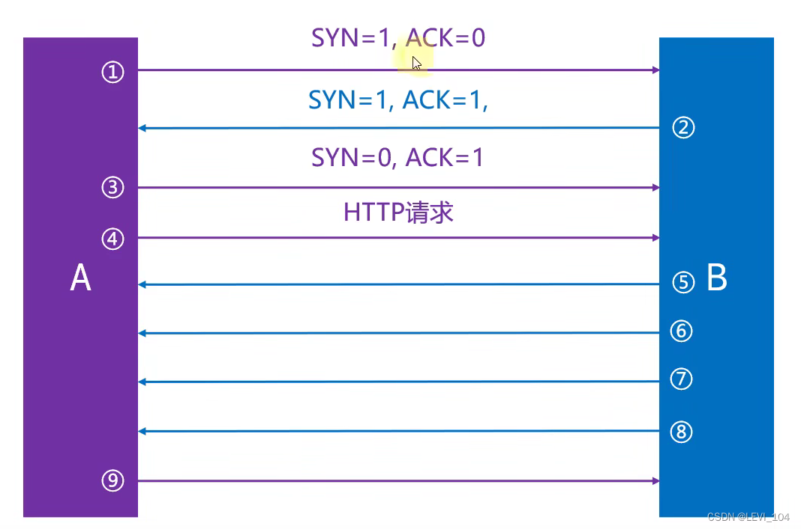
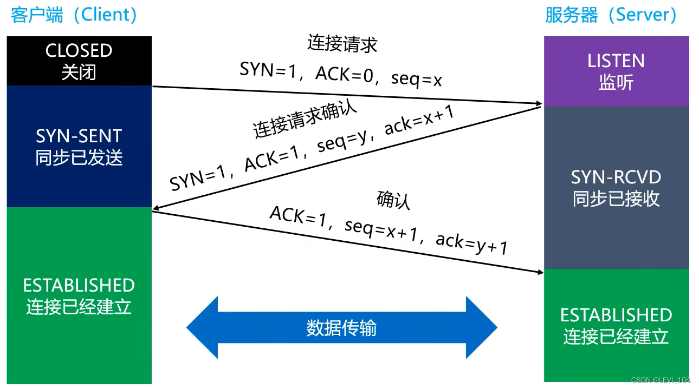
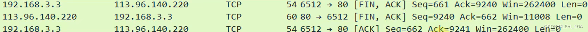

# TCP

### TCP--数据结构

- data offset： 
  - about 4 bits，data range : 0x0101~0x1111。
  - multiply 4：Header Length
  - Header Length's bytes :20~60
- reserve：about 6 bits，but now it is all zero

###  TCP--小细节

in some materials，TCP Header Length's Reserved segment is about 3 bits，Flags segment is about 9 bits. The same situation is in Wireshark.

- There is a 16-bits segment in UDP's Header Length, which records the whole UDP segment's length（Header Length + data）,but there is only a 4 bits segment that recordsthe TCP's Header Length, no segment to record TCP's data length.
- analyze 
  - The 16-bit length in the UDP header is redundant，it is purely to ensure that the header is 32bit aligned.
  - TCP/UDP‘s data length can be calculated by IP data packet's Header Length.
  - Translate's data length=Network's length - NetWork's Header Length - Translate's Header Length

### TCP--检验和

- TCP's Checksum：pseudo-header　＋　Header　＋　data
- pseudo-header：about 12 bytes，it only works when calculating the checksum，not transmits to Network layer.

###  TCP－－标志位

- URG（Urgent）：the Urgent pointer is valid only when URG = 1.It indicates that urgent data exists in the current packet segment and should be transmitted preferentially。紧急指针是一个length，它是从数据部分开始长度为length的数据部分出错。
- ACK（Acknowledgment）：Acknowledgement number is valid only when ACK = 1
- PSH（Push）：dont study
- RST（Reset）：It indicates that a serious error occurred in the connection when RST = 1. PC must release the connection and then build connection again.
- SYN（Synchronization）：It indicates that this is a request to establish a connection when SYN=1 and ACK = 0.If opponent allows to build connection, he will reply SYN=1 and ACK = 1.
- FIN（finish）：It indicates that the data has been sent already and requests to release connection.

### TCP－－序号、确认号、窗口

- 序号（Sequence Number）：about 4 bytes。Each byte in Transmit has a serial number. When finishing building connection, the serial number is on behalf of：THe fist byte's serial number of TCP's data part.
- 确认号（Acknowledge Number）：about 4 bytes. After building connection, the Acknowledge number is on behalf of : The serial number of the first byte of the TCP data portion that is expected to be transmitted next time.
- 窗口（Window）：about 2 bytes. This field has a flow control function and tells the other party how much data is allowed to be sent next time (in bytes).

 上图：序号

 上图：确认号

## 可靠传输

### 可靠传输－－停止等待ARQ协议

ARQ（Automatic Repeat-reQuest），自动重传请求

### 可靠传输－－连续ARQ协议+滑动窗口协议

 Let's elaborate on the above figure below

 Assume that each group of data is 100 bytes, representing the data of a data segment, and each group is given a serial number.

抓包演示

### 

### TCP--SACK（选择性确认）

- During TCP communication, if a IP data packet in the middle of the transmission sequence is lost (for example, 3 of 1, 2, 3, 4, 5 is missing).   TCP retransmits the last confirmed IP data packet to subsequent IP data packets (the last confirmed IP data packet is 2, and the last confirmed IP data packet is 3, 4, and 5). In this way, IP data packets that have been correctly transmitted may be repeatedly sent (such as 4 and 5, which degrades TCP performance).
- To improve this situation, the SACK (Selective Acknowledgment) technique was developed.  Tell the sender what data is missing and what data has been received in advance.  TCP resended only the lost packet (e.g. 3) instead of sending all subsequent packets (e.g. 4, 5)

### 疑问 

- If an IP data packet fails to be retransmitted n times, will it always be retransmitted? This depends on the system Settings. For example, some systems will send RESET after 5 retransmissions

- Insufficient receiving window size: If the receiving window can receive up to 4 packets, the sender only sends 2 packets. How does the receiver determine if there are two more packets to come? Answer: IF there is no third packet after a certain amount of time, the sender will be sent a confirmation that 2 packets have been received

- Why do you choose to split the data into multiple segments at the transport layer instead of waiting for the network layer to fragment and pass it to the data link? Because you can improve the performance of retransmission. 

  - To be clear: reliable transport is controlled at the transport layer. If the transport layer is not segmented, once data loss occurs, the entire transport layer data has to be retransmitted. If you divide segments at the transport layer, only the lost segments need to be retransmitted in case of data loss
  - 

## TCP--流量控制

如果接收方的缓存区满了，发送方还在疯狂着发数据。接收方只能把收到的数据包丢掉，大量的丢包会极大浪费网络资源，所以要进行流量控制。

什么是流量控制？答案：让发送方的发送速率不要太快，让接收方来得及接收处理

原理：通过确认报文中窗口字段来控制发送方的发送速率，发送方的发送窗口大小不能超过接收方给出窗口大小，当发送方收到窗口的大小为0时，发送方就会停止发送数据。

 注释：rwnd是接收窗口（receive window）

### TCP--流量控制--特殊情况

有一种特殊情况：一开始，接收方给发送方发送了0窗口的报文段，后面，接收方又有了一些存储空间，给发送方发送的非0窗口的报文段丢失了，发送方的发送窗口一直为0，双方陷入僵局

解决方案：当发送方收到0窗口通知时，这时发送方停止发送报文，并且同时开启一个定时器，隔一段时间就发个测试报文去询问接收方最新的窗口大小，如果接收的窗口大小还是为0，则发送方再次刷新启动计时器

## TCP--拥塞控制

拥塞控制：防止过多的数据注入到网络中，避免网络中的路由器或者链路过载。拥塞控制是一个全局性的过程，涉及到所有的主机、路由器，以及与降低网络传输性能有关的所有因素。相比而言，流量控制是点对点通信的控制

###  TCP--拥塞控制--方法

- 慢开始（slow start ，慢启动）
- 拥塞避免（congestion avoidance）
- 快速重传（fast retransmit）
- 几个缩写 
  - MSS（Maximum Segment Size）：每个段最大的数据部分大小，在建立连接时确定
  - cwnd（congestion window）：拥塞窗口
  - rwnd（receive window）：接收窗口
  - swnd（send window）：发送窗口。swnd = min（cwnd,rwnd）

### TCP--拥塞控制--慢开始

###  TCP--拥塞控制--拥塞避免

- ssthresh(slow start threshold)：慢开始阈值，cwnd达到阈值后，以线性方式增加
- 拥塞避免（加法增大）：拥塞窗口增大，以防止过早出现拥塞
- 乘法减小：只要网络出现拥塞，把ssthrest减半，于此同时，执行慢开始算法（cwnd又恢复到初始值）
- 当网络出现频繁拥塞时，ssthresh值就下降的很快

###  TCP--拥塞控制--快重传

- 接收方 
  - 每收到一个失序的分组后就立即发出重复确认
  - 使发送方及时知道分组没有到达
  - 而不要等待自己发送数据时才进行取人
- 发送方 
  - 只要连续收到三个重复确认（总共4个相同的确认），就应当立即重传对方尚未收到的报文段，而不必继续等待重传计时器到期后再重传

### TCP--拥塞控制--快恢复

tcp快速恢复算法在接收到3个"重复"ACK后会产生会执行
 算法流程如下:

1. 收到第3个重复的ACK时，将ssthresh设置为当前cwnd的一半。
2. 设置cwnd=ssthresh+3
3. 重传丢失的报文段
4. 每收到一个重复的ACK，cwnd+1
5. 确认新数据的ACK到达时，设置cwnd=ssthresh。

思考:1) 为何第二步操作的cwnd需要+3
 2）为何第4步每次收到重复的ACK，cwnd会加一
 3）为何新数据的ACK到达时，设置cwnd=ssthresh

理解:收到3个重复的ACK意味着网络很有可能没有阻塞。比如有报文段1，2，3，4 重复收到报文段1的序号，那么意味着实际上2，3，4都是到达了对方，如果此时只将cwnd减半，那么很有可能未确认的报文数量是要大于或接近cwnd的，此时数据几乎不发送，而当新的ACK达到时，滑动窗口右滑，又可能造成大量的数据同时发送出去。既然有3个重复的ACK，那么至少有3个包是离开了网络的，我们就可以透支给cwnd+3，以后每当收到一个重复的ACK，就意味着一个包离开网络，我们就可以给cwnd+1。而当新的ack到达时，如果不把cwnd还原，很有可能会发送大量的数据出去，所以最好的办法是将透支的大小都给还回来

###  TCP--拥塞控制--快重传+快恢复

### TCP--拥塞控制--发送窗口的最大值 

- 发送窗口的最大值：swnd = min(cwnd, rwnd)
- 当rwnd < cwnd时，是接收方的接收能力限制发送窗口的最大值
- 当cwnd < rwnd时，则是网络的拥塞限制发送窗口的最大值

### TCP--序号、确认号

##  TCP--建立连接

###  TCP--建立连接--三次握手

### TCP--建立连接--疑问

为什么是三次握手，两次不行吗？主要目的：防止server端一直等待，浪费资源

如果建立连接只需要2次握手，可能出现的情况如下：

假设client发出的第一个连接请求报文段，因为玩了个延迟，再连接释放以后的某个时间才到达server，本来这是一个早已经失效的连接请求，但server收到此失效的请求后，误认为是client再次发送的一个新的连接请求，于是server就向client发出确认报文段，同意建立连接，如果不采用三次握手，那么只要server发出确认，新的连接就建立了。由于现在client并没有真正想连接服务器的意愿，因此不会理睬server的确认，也不会像server发送数据，但server却认为新的连接已经建立，并一直等待client发来数据，这样，server的很多资源就白白浪费了。

 采用三次握手可以防止上述现象，例如上述情况，client没有向server的确认发出确认，server由于收不到确认，就知道client并没有要求建立连接

但是，如果第三次握手失败了，会如何处理？答案：此时server的状态为SYN-RCVD，如果等不到client的ACK，server就会重新发送SYN+ACK包，如果server多次重发SYN+ACK都等不到client的ACK，就会发送RST包，强制关闭连接

##  TCP--释放连接

###  TCP--释放连接--4次挥手

 状态解读：

- FIN-WAIT-1：表示想主动关闭连接，向对方发送了FIN报文，此时进入到FIN-WAIT-1状态
- CLOSE-WAIT：表示在等待关闭，当对方发送FIN给自己，自己会回应一个ACK报文给对方，此时。。。。。在此状态下，需要考虑自己是否还有数据要发送给对方，如果没有，发送FIN报文给对方
- FIN-WAIT-2：只要对方发送ACK确认后，主动方就会处于FIN-WAIT-２状态，然后等待对方发送FIN报文
- CLOSING：一种比较罕见的例外状态。表示你发送FIN报文后，并没有收到对方的ACK报文，反而却收到对方的FIN报文。如果对方几乎在同时准备关闭连接的话，那么就出现了双方同时发送FIN报文的情况，也即出现CLOSING状态，表示双方都正在关闭SOCKET连接
- LAST-ACK：被动关闭的一方发送FIN报文后，最后等待对方的ACK报文，当收到ACK报文后，即可进入CLOSED状态了
- TIME-WAIT：表示收到了对方的FIN报文，并发送出了ACK报文，就等2MSL后即可进入CLOSED状态了。如果FIN-WAIT状态下，收到了对方同时带有FIN标志和ACK状态的报文时，可以直接进入到TIME-WAIT状态，而无需经过FIN-WAIT-2状态
- 由于有些状态的时间比较短暂，所以很难用netstat命令看到，比如：SYN-RCVD、FIN-WAIT-1

###  TCP--释放连接--疑问

为什么释放连接的时候，要进行4次挥手？

TCP是全双工模式

- 第一次挥手：当主机1发出FIN报文时，表示主机1已经没有数据要发送了，但是，此时主机1还是可以接收来自主机2的数据
- 第二次挥手：当主机2返回ACK报文时，表示主机2已经知道主机1没有数据发送了，但是主机2还是可以发送数据到主机1的
- 第三次挥手：当主机2也发送了FIN报文段时，表示主机2已经没有数据要发送了
- 第四次挥手：当主机1返回ACK报文段时，表示主机1已经知道主机2没有数据发送了，随后正式断开整个TCP连接 

###  TCP－－释放连接－－细节

- TCP／IP协议栈在设计上，允许任何一方先发起断开请求，这里演示的是client主动要求断开
- client发送ACK后，需要有个TIME－WAIT阶段，等待一段时间后，再真正关闭连接。一般是等待２倍的MSL（Maximum Segment Lifetime，最大分段生存周期），MSL是TCP报文在Internet上最长的生存时间，每个具体的TCP实现都必须选择一个确定的MSL值，RFC 1122建议是两分钟。可以防止本次连接中产生的数据包误传到下一次连接中（因为本次连接中的数据包都会在２MSL时间内消失）
- 如果client发送ACK后马上释放了，然后又因为网络问题，server没有收到client的ACK，server就多次发送确认信息给client
- 这时可能的情况是： 
  - client没有任何响应，服务器那边会干等，甚至多次发送FIN，浪费资源
  - client有个新的应用程序刚好分配了同一个端口号，新的应用程序收到FIN后马上开始执行断开连接，但它可能是想跟server建立连接的

### TCP－－释放连接－－抓包

有时候在使用抓包工具的时候，有可能只会看到三次挥手，这其实是将第２、３次挥手合并了

当serve接收到client的FIN时，如果server后面也没有数据要发送给client了，这时，server就可以将第２、３次挥手合并，同时告诉client两件事：已经知道client没有数据要发；server已经没有数据要发了