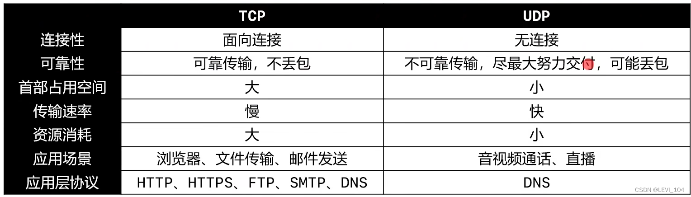
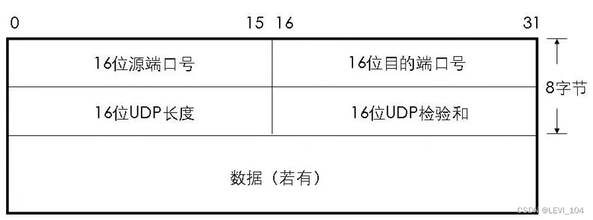
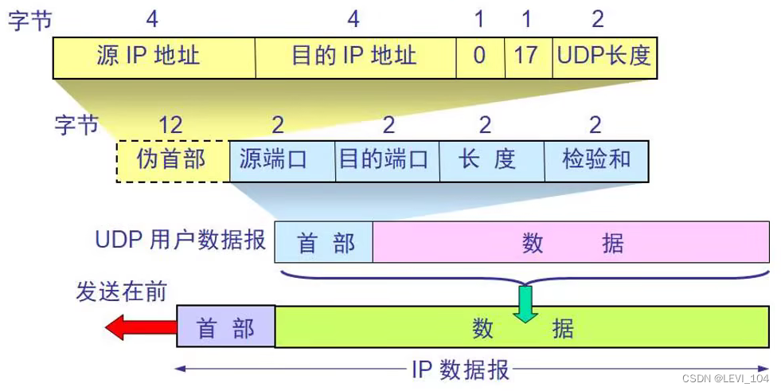
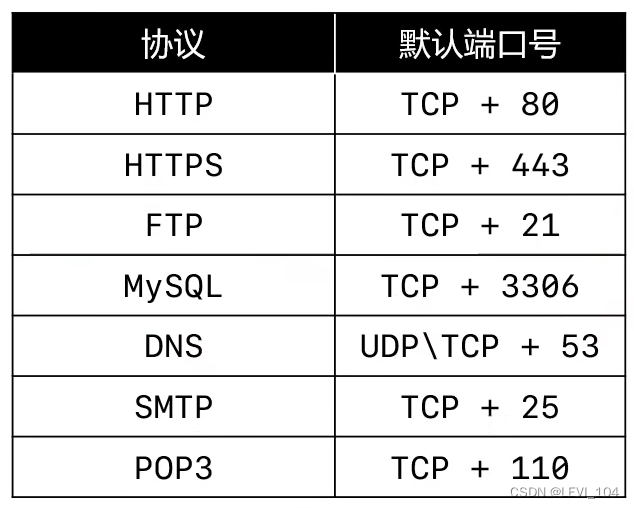

# 传输层

传输层(Transport)有两个协议：TCP（Transmission Control Protocol），传输控制协议。UDP(User Datagram Protocol)，用户数据报协议

##  UDP

### UDP--数据格式

- UDP是无连接的，减少了建立和释放连接的开销
- UDP尽最大能力交付，不保证可靠交付
- 因此不需要维护一些复杂的参数，首部只有8个字节（TCP的首部至少20个字节）

 UDP长度：占16位，首部的长度 + 数据的长度

### UDP--检验和（Checksum）

检验和的计算部分：伪首部 + 首部 + 数据 

### 端口

- UDP首部中端口是占用2字节，可以推测出端口号的取值范围是：0~65535
- 客户端的源端口是临时开启的随机端口
- 防火墙可以设置开启和关闭某些端口来提高安全性

 常用命令行

- netstat -an：查看被占用的端口
- netstat -anb：查看被占用的端口，占用端口的程序，需要管理员权限
- telent 主机 端口：查看是否可以访问主机的某个端口 
  - 按照telent：控制面板--程序--启用或关闭Windows功能--勾选Telent Client选项