# 应用层

## 应用层的常见协议

- 超文本传输：HTTP、HTTPS
- 文本传输：FTP
- 电子邮件：SMTP、POP３、IMAP
- 动态主机配置：DHCP
- 域名系统：DNS

## 域名（Domain Name）

由于IP地址不方便记忆，并且不能表达组织的名称和性质，人们设计出了域名（比如baidu.com），但实际上能够访问到具体的主机，最终还是得知道目标主机的IP地址。域名申请注册：[域名注册-工商财税-知识产权-资质备案-智能设计-网站建设-万网-阿里云旗下品牌](https://wanwang.aliyun.com/)

那干脆全程直接用域名，不用IP地址？IP地址固定４个字节，域名随随便便都至少十几个字节，这无疑会增加路由器的负担，浪费流量

根据级别不同，域名分为顶级域名（Top-level Domain，简称TLD），二级域名，三级域名。。。

### 域名－－顶级域名的分类

- 通用顶级域名（General Top-level Domain，简称gTLD） 
  - ．ｃｏｍ：公司
  - ．ｎｅｔ：网络机构
  - ．ｏｒｇ：组织机构
  - ．ｇｏｖ：政府部门
  - ．ｉｎｔ：国际组织
- 国家以及地区顶级域名（Country Code Top-level Domain，简称ccTLD） 
  - ．ｃｎ：中国
  - ．ｊｐ：日本
  - ．ｕｋ：英国
- 新通用顶级域名（New Generic Top-level Domain，简称：New gTLD） 
  - .ｖｉｐ
  - ．ｘｙｚ
  - ．ｔｏｐ
  - ．ｃｌｕｂ
  - ．ｓｈｏｐ

### 域名－－二级域名

二级域名是指顶级域名之下的域名，在通用顶级域名下，它一般指域名注册人的名称，例如：google、baidu等。在国家以及顶级域名下，它一般指注册类别的，例如：com, edu, gov, net等

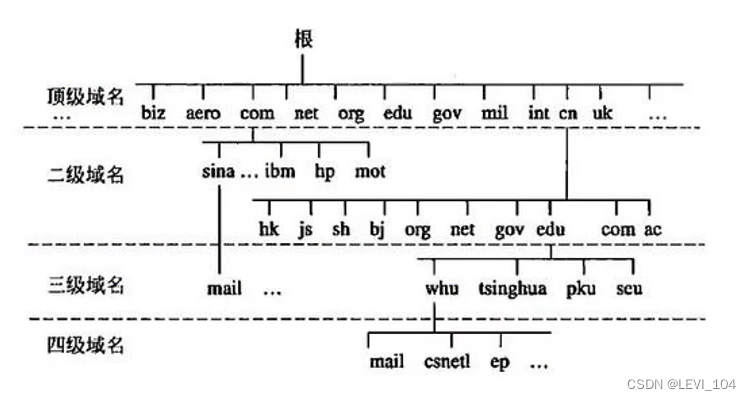

##  DNS

DNS的全称是Domain Name System，译为：域名系统。利用DNS协议，可以将域名（比如baidu.com)解析成对应的IP地址。DNS可以基于UDP协议，也可以基于TCP协议，服务器占用５３端口

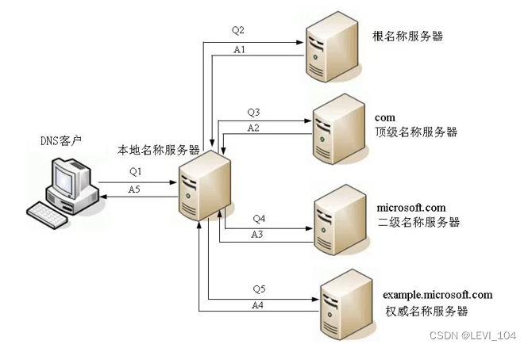

### DNS--服务器

- 客户端首先会访问最近的一台DNS服务器（也就是客服端自己配置的DNS服务器）
- 所有的DNS服务器都记录了DNS根域名服务器的IP地址
- 上级DNS服务器记录了下一级DNS服务器的IP地址
- 全球共13台IPv4的DNS根域名服务器、25台IPv6的DNS根域名服务器

## DHCP

### IP地址的分配

IP地址按照分配方式，可以分为IP地址、动态IP地址

静态IP地址：手动设置。适用环境：不怎么挪动的台式机（比如学校机房中的台式机）、服务器等
 动态IP地址：从DHCP服务器自动获取IP地址。适用场景：移动设备、无线设备等

### DHCP

- DHCP（Dynamic Host Configuration Protocol），译为：动态主机配置协议
- DHCP协议基于UDP协议，客户端是68端口，服务器是67端口
- DHCP服务器会从IP地址池中，挑选一个IP地址“出租”给客户端一段时间，时间到期就回收它们，平时家里上网的路由器就可以充当DHCP服务器

### DHCP－－分配IP地址的４个阶段

- DISCOVER：发现服务器。发广播包（源IP是0.0.0.0，目标IP是255.255.255.255，目标MAC是FF.FF.FF.FF.FF.FF
- OFFER：提供租约。服务器返回可以租用的IP地址，以及租用期限、子网掩码、网关、DNS等信息注意：这里可能会有多个服务器提供租约
- REQUEST：选择IP地址。客户端选择一个OFFER，发送广播包进行回应
- ACKNOWLEDGE：确认。被选中等待服务器发送ACK数据包给客户端

### DHCP--四个阶段

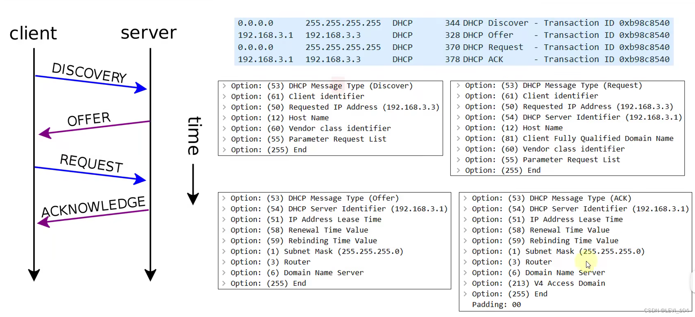

##  HTTP

HTTP(Hyper Text Transfer Protocol)，译为超文本传输协议，是互联网中应用最广泛的应用层协议之一，设计HTTP最初的目的是：提供一种发布和接收HTML页面的方法，由URI来标识具体的资源。后面HTTP来传递的数据格式不仅仅是HTML，应用非常广泛。HTML（Hyper Text Markup Language）：超文本标记语言，用以编写页面

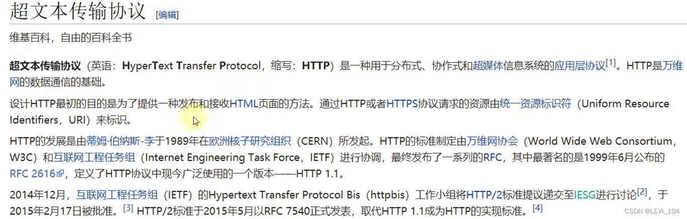

###  版本

- 1991年，HTTP/0.9，只支持GET请求方法获取文本数据（比如HTML文档），且不支持请求头、响应头等，无法向服务器传递太多的信息
- 1996年，HTTP/1.0，支持POST、HEAD等请求方法，支持请求头、响应头等，支持更多种数据类型（不再局限于文本数据），浏览器的每次请求都需要与服务器建立一个TCP连接，请求处理完成后立即断开TCP连接
- 1997年，HTTP/1.1（最经典、使用最广泛的版本）。支持PUT、DLETE等请求方法，采用持久连接（Connection ：keep-alive），多个请求可以共用一个TCP连接
- 2015年，HTTP/2.0
   2018年, HTTP/3.0（草稿阶段）

### 标准

HTTP的标准：由万维网协会（W3C）、互联网工程任务组协调制作，最终发布一系列的RFC

RFC（Request　For　Comments，可以译为：请求意见稿）。HTTP／１.１最早是在1997年的RFC 2068种记录的，该规范在1999年的RFC 2616中已作废，2014年又由RFC 7230系列的RFC取代。HTTP/2标准于2015年5月以RFC 7540正式发表，取代HTTP/1.1成为HTTP的实现标准

### 报文格式

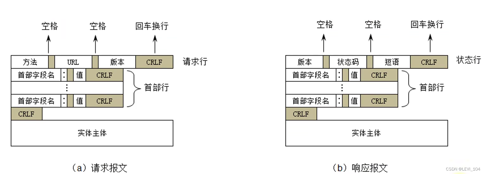

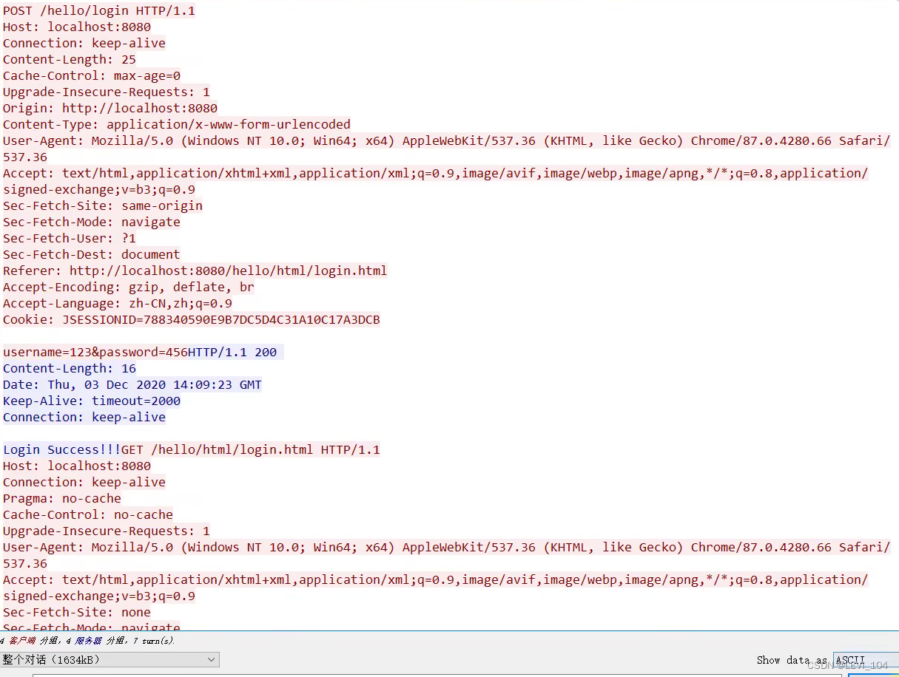

 ｇｅｔ请求没有实体主体

### ABNF

### ABNF－－核心规则

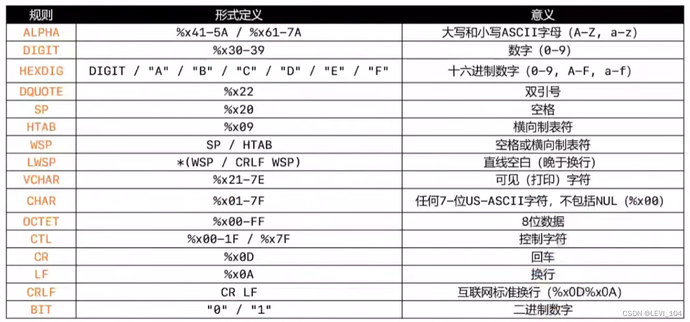

### 报文格式－－整体

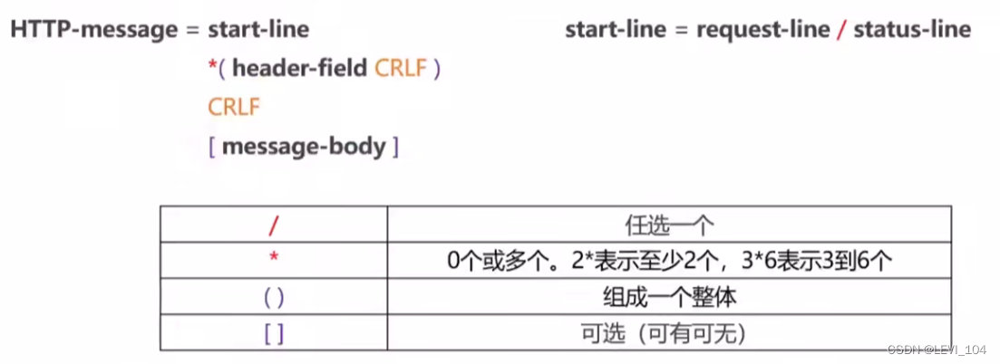

### 报文格式－－request-line、statue-line

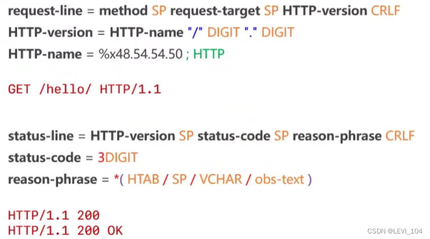

###  报文格式－－header-filed、message-body

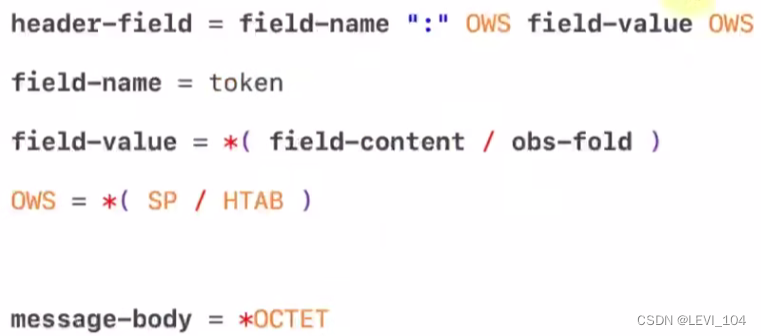

###  Xshell + telent

可以直接面向HTTP报文与服务器交互，可以更加清晰直观地看到请求报文、响应报文的内容，检验请求报文的格式正确与否

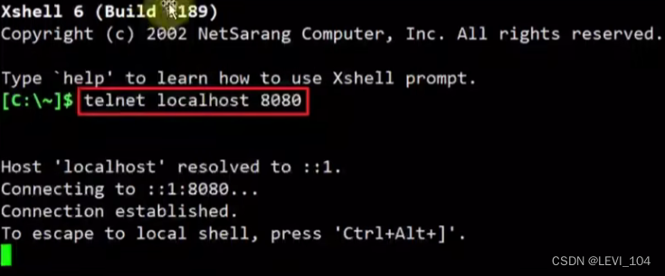

###  请求方法

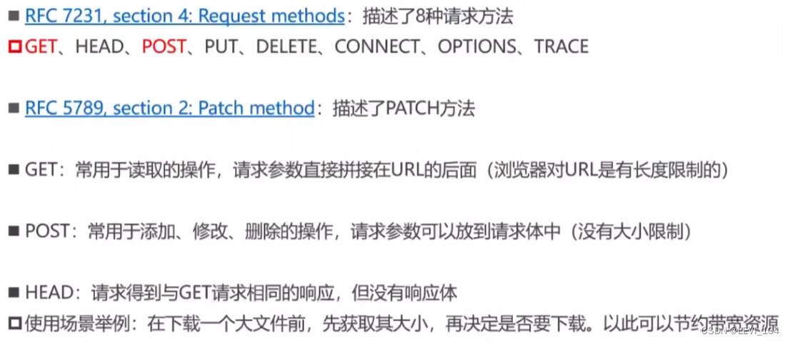

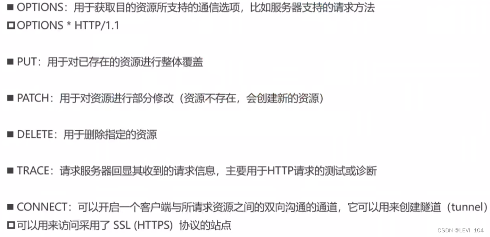

###  头部字段（Header Field）

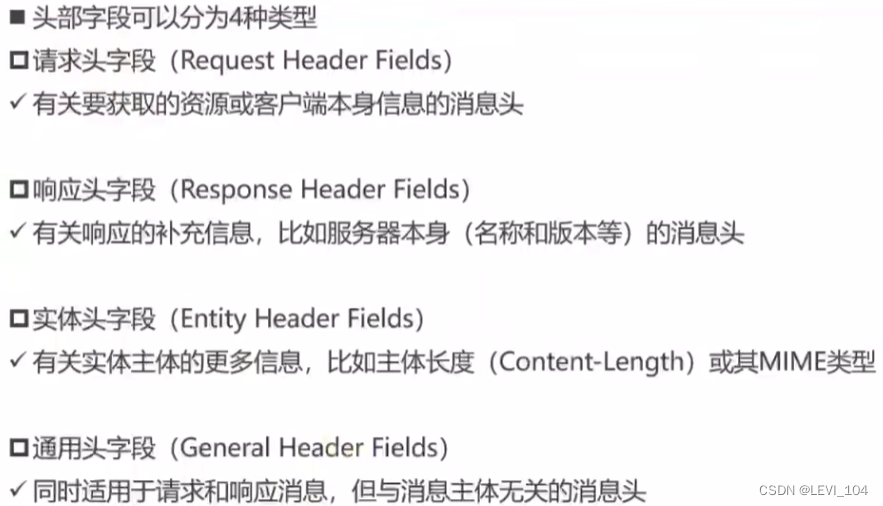

###  请求头字段

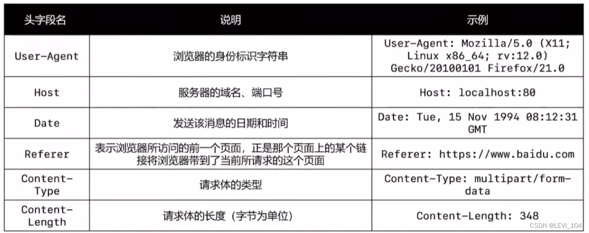

 注释：Referer可以用于防盗链

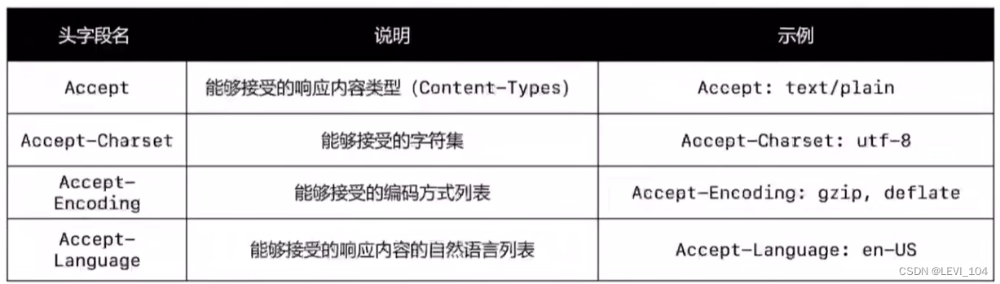

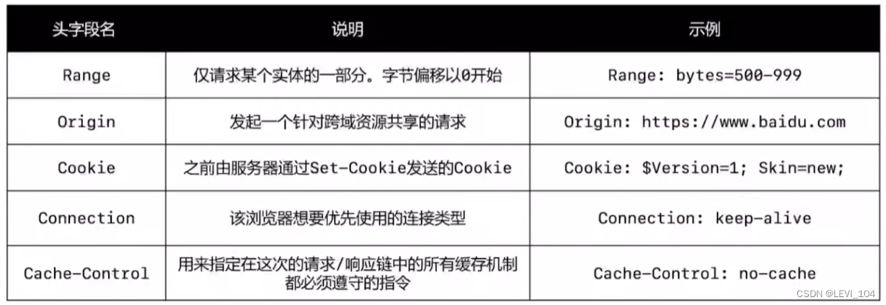

###  响应头字段

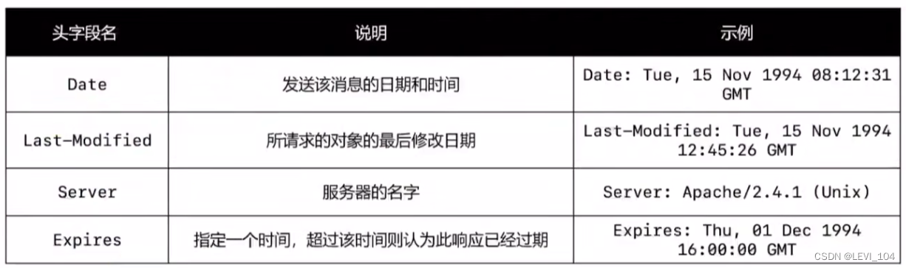

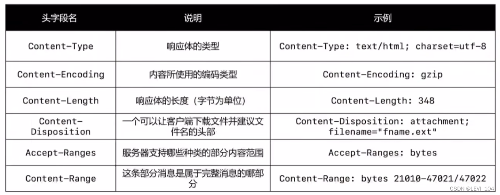

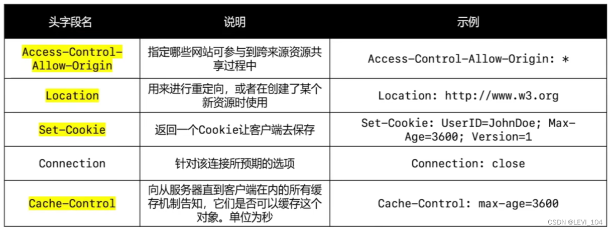

### 状态码

在RFC 2626 10.Status Code Definitions规范中定义，状态码知识HTTP请求是否已成功完成

状态码可以分为5类：

- 信息响应：100~199
- 成功响应：200~299
- 重定向：300~399
- 客户端错误：400~499
- 服务器错误：500~599

### 常见状态码

- 100 Continue：请求的初始部分已经被服务器收到，并且没有被服务器拒绝。客户端应该继续发送剩余的请求，如果请求已经完成，就忽略这个响应。允许客户端发送带请求体的请求前，判断服务器是否愿意接收请求（服务器通过请求头判断）。在某些情况下，如果服务器在不看请求体就拒绝请求时，客户端就发送请求体时不恰当的或低效的
- 200 OK：请求成功
- 302 Found：请求的资源被暂时的移动到了由Location头部指定的URL上
- 304　Not　Modified：说明无需再次传输请求的内容，也就是说可以使用缓存的内容
- 400　Bad　Request：由于语法无效，服务器无法理解该请求
- 401 Unauthorized ：由于缺乏目标资源要求的身份验证凭证
- 403 Forbidden：服务器端有能力处理该请求，但是拒绝授权访问
- 404 Not Found：服务器无法找到所请求的资源
- 405 Method Not Allow：服务器禁止了使用当前HTTP方法的请求
- 406 Not Acceptable：服务器端无法提供与Accept-Charset以及Accept-Language指定的值相匹配的响应
- 408 Request TImeout：服务器想要没有在使用的连接关闭。一些服务器在空闲连接上发送此消息，即便是在客户端没有发送任何请求的情况下
- 500 Internal Server Error：所请求的服务器遇到意外的情况并组织其执行请求
- 501 Not Implemented：请求的方法不被服务器支持，因此无法被处理。服务器必须支持的方法（即不会返回这个状态码的方法）只有GET和HEAD
- 502　Bad　Gateway：作为网关或者代理角色的服务器，从上游服务器（如tomcat）中接收到的响应是无效的。
- 503　Service　Unavailable：服务器尚未处于可以接收请求的状态。通常造成这种情况的原因是由于服务器停机维护或者已经超载

### form提交－常用属性

- action：请求的URI
- method：请求方法（GET，POST）
- enctype：POST请求超时时，请求体的编码方式。application/x-www-form-urlencoded（默认值）。用&分隔参数，用=分隔键和值，字符用URL编码方式进行编码
- multiparty/form-data：文件上传时必须使用这种编码方式

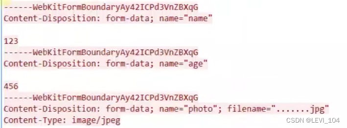

###  form提交--multiparty/form-data

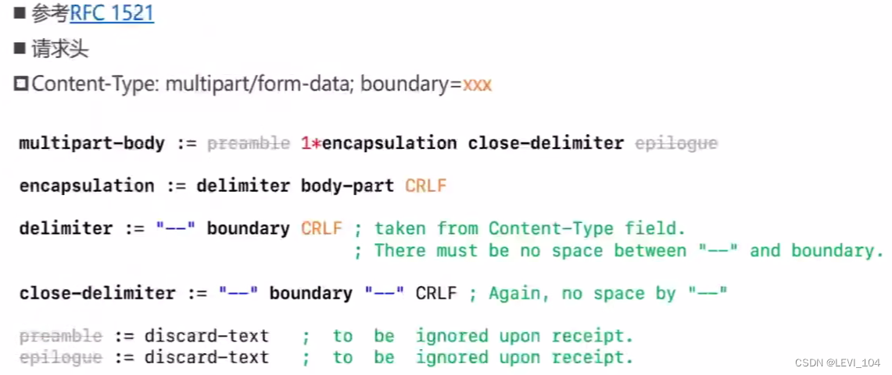

###  同源策略

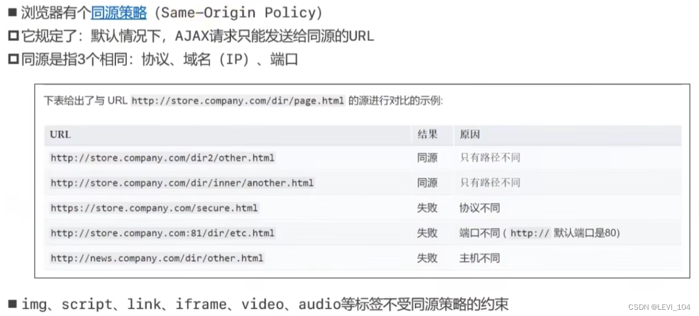

### 跨域资源共享

- 解决AJAX跨域请求的常用方法：CORS（Cross－Origin　Resource　Sharing），跨域资源共享
- CORS的实现需要客户端和服务器同时支持： 
  - 客户端（所有的浏览器都支持，IE至少是IE１０版本）
  - 服务器：需要返回相应的响应头（比如：Access－Control－Allow－Origin），告知浏览器这是一个允许跨域访问的请求

### Cooike

Cooike：在客户端（浏览器）存储一些数据，存储到本地磁盘（硬盘），服务器可以返回Cookie交给客户端去存储

Session：在服务器存储一些数据，存储到内存

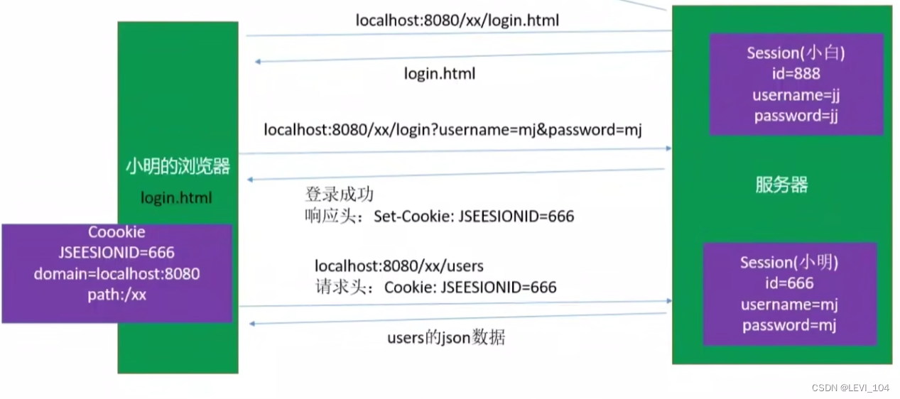

-  domain和path标识定义了Cookie的作用域，即Cooike应该发送给哪些URL。
- domain 
  - 标识制定了哪些主机可以接收Cookie
  - 如果不指定，默认为当前文档的主机（不包含子域名）；如果指定了domain，则一般包含于指定的路径
  - 例如：设置domain＝520it．com，则Cookie也包含在子域名中（如：bbs.520it.com）
- path 
  - 标识制定了主机下哪些路径可以接收Cookie，子路径也会被匹配
  - 例如：设置path＝／docs，则以下地址都会匹配 	
    - ./docs
    - ./docs/one/
    - ./docs/one/img

- Cooke是直接存储在浏览器本地的一小串数据 
  - 使用document．cookie访问Cookie
  - 修改Cookie时，只会修改其中提到的Cookie
  - name＝value必须被编码（encodeURIComponent）
  - 一个Cookie最大为４KB，每个网站最多有20+个左右的Cookie（具体取决于浏览器）
- Windows中Chrome浏览器的Cookie存放位置 
  - C:\Users\用户名\AppData\Local\Google\Chrome\User Data\Default\Cookies
  - 使用SQLite数据库进行存储
- Session的有效期默认是30分钟，可以在web．ｘｍｌ配置中设置失效时间

### Cookie的有效期

- 如果没有设置Cookie的过期时间，则当浏览器关闭时，Cookie就失效了
- expires 
  - 必须完全采用GMT时区的格式，可以使用date．toUTCString来获取
  - 例如：expires=Tue, 19 Jan 2038 03:14:07 GMT
- max-age 
  - 过期时间距离当前时间的秒数
  - 例如：max-age = 60

### 服务器设置Cookie

Cookie通常是由Web服务器使用响应头Set-Cookie设置的

关于max-age：在JavaScript中：如果设置为0或者负数，会立即删除Cookie。在Java中：如果设置为0，会立即删除Cookie；如果设置为负数，按默认方式处理

### 会话跟踪

- HTTP是一种“无状态”（stateless）的协议 
  - 每一次客户端访问网页的时候，客户端都会打开与Web服务器的单独链接
  - 并且服务器不会自动保留之前客户端请求的任何记录
  - 所以服务器无法识别多个请求是否来自同一个客户端（比如浏览器）
- 在很多应用场景中，都有以下需求 
  - 服务器能够识别出多个请求是否来自同一个客户端
  - 在来自同一个客户端的多个请求之间共享数据
- 以上需求可以使用会话跟踪技术来完成，在Java中，实现会话跟踪常用的方案是Cookie和Session

### 代理服务器（proxy　Server）

特点：本身不生产内容。处于中间位置转发上下游的请求和响应（面向下游的客户端时服务器，面向上游的服务器是客户端）

### 正向代理、反向代理

正向代理：代理对象是客户端。反向代理：代理对象是服务器

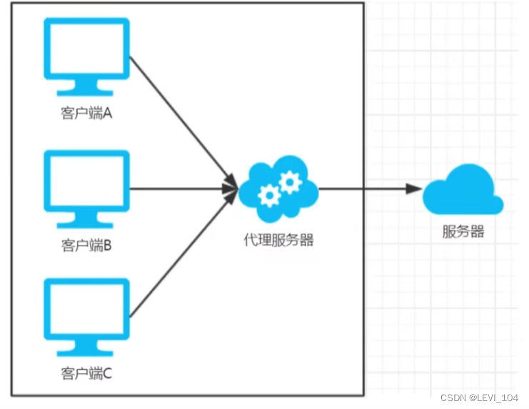

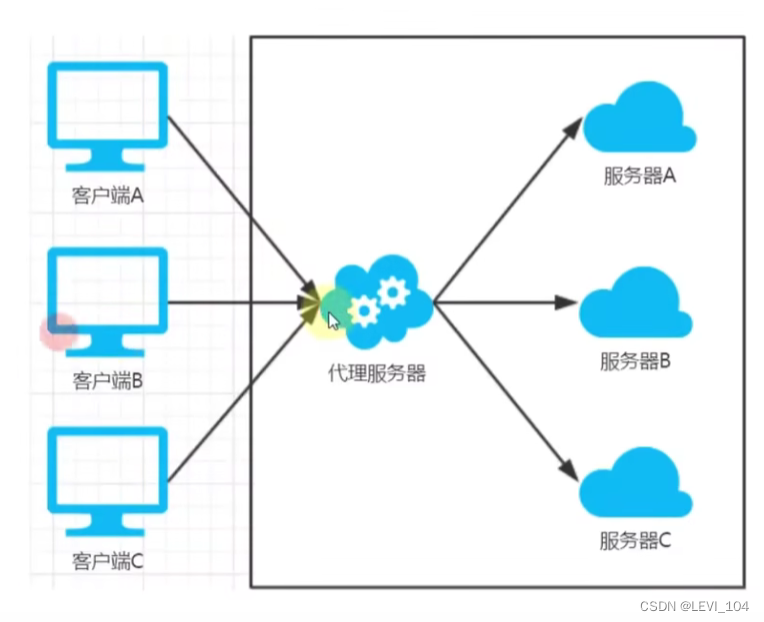

###  正向代理

- 隐藏客户端身份
- 绕过防火墙（突破访问限制）
- Internet访问控制
- 数据过滤
- .......

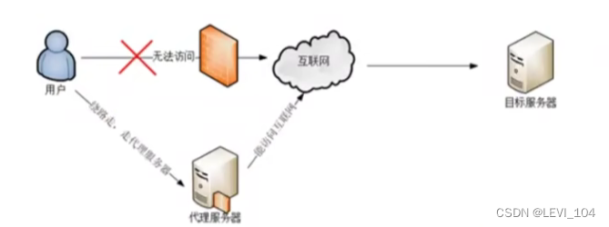

### 反向代理

- 隐藏服务器身份
- 安全防护
- 负载均衡 

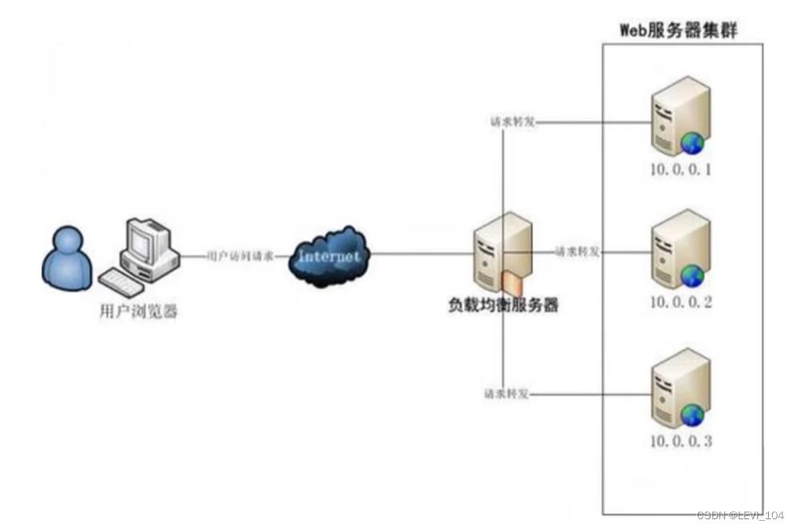

### 代理服务器--相关的头部字段

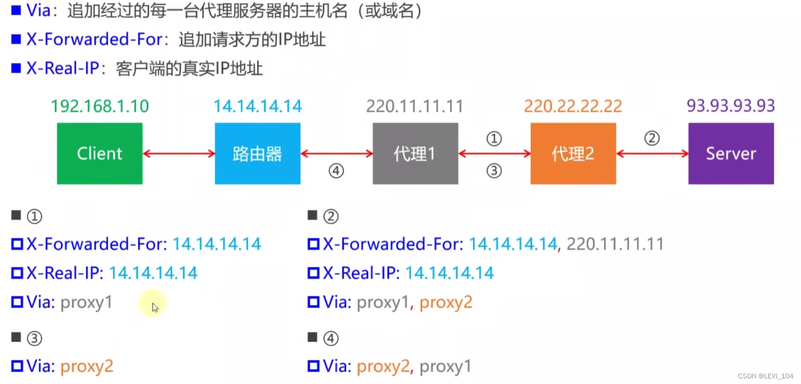

### CDN

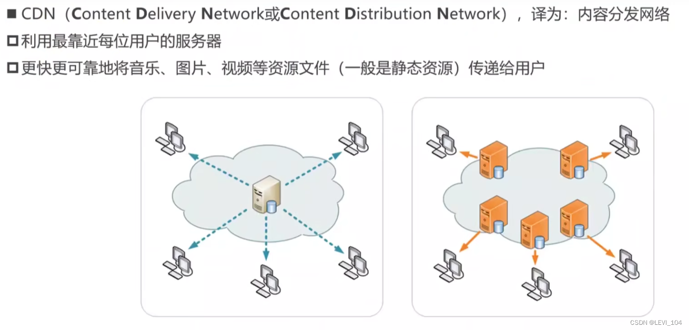

 CDN运营商在全国、乃至全球的各大枢纽城市都建立了机房，部署了大量拥有高存储高带宽的节点，构建了一个跨运营商、跨地域的专用网络。内容所有者向CDN运营商支付费用，CDN将其内容交付给最终用户

使用CDN前

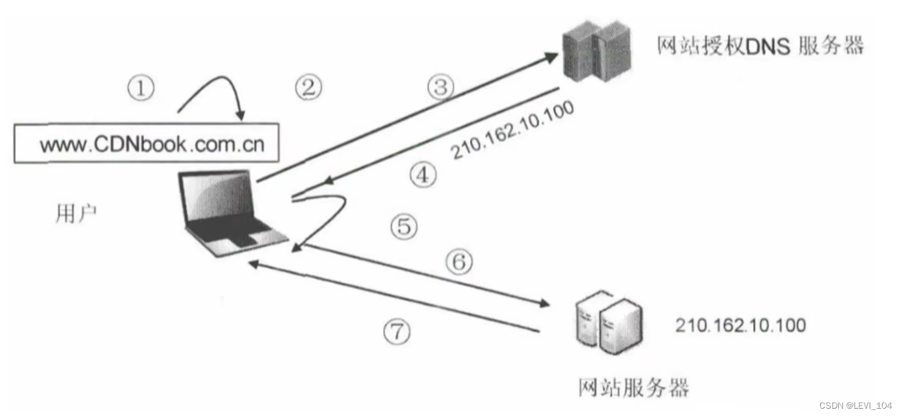

 使用CDN后

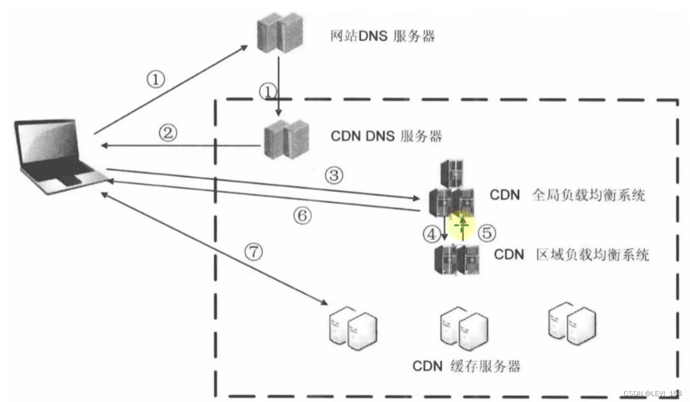

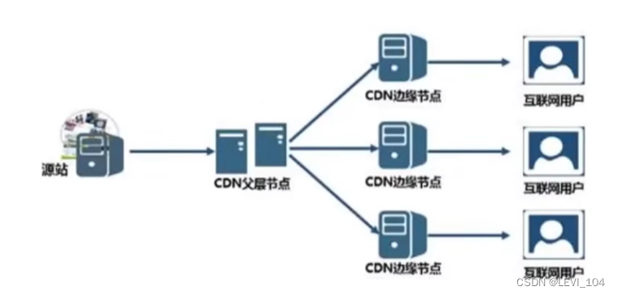

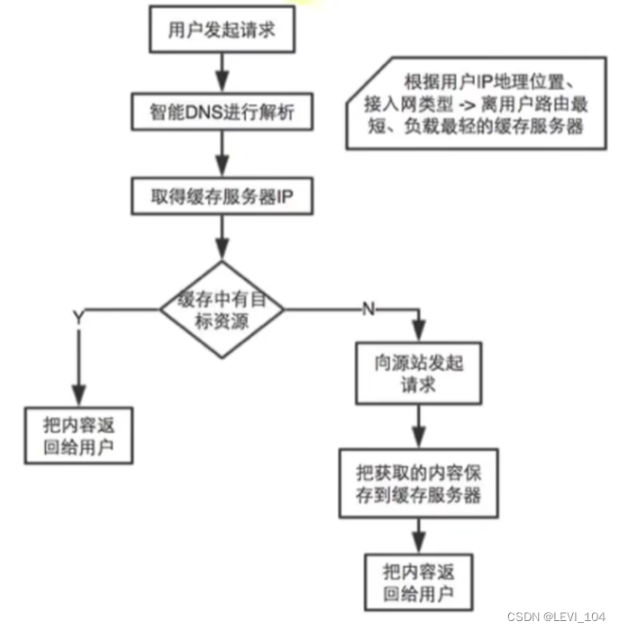