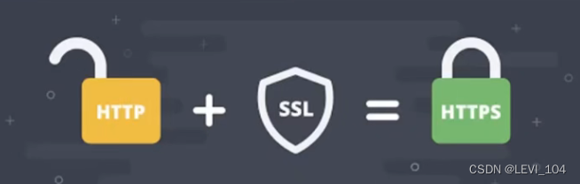
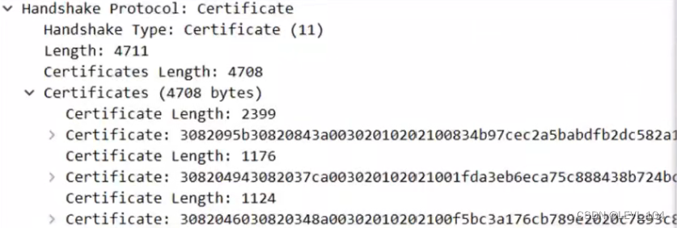

# HTTPS

## 简介

HTTPS的端口号是443，HTTP是80。HTTPS（HyperText Transfer Protocol Secure），译为：超文本传输安全协议，常称为HTTP over TLS、HTTP over SSL、HTTP Secure，由网景公司于1994年首次提出

### SSL/TLS

HTTPS是在HTTP的基础上使用SSL/TLS来加密报文，对窃听和中间人攻击提供合理的防护

-  TLS（Transport Layer Security），译为：传输层安全性协议。前身是SSL（Secure Sockets Layer），译为：安全套接层）
- 历史版本 
  - SSL 1.0：因为存在严重的安全漏洞，从未公开过
  - SSL 2.0：1995年，已于2011年弃用，RFC 6176
  - SSL 3.0：1996年，已于2015年弃用，RFC 7568
  - TLS 1.0：1999年，RFC 2246
  - TLS　1.1：2006年，RFC　4346
  - TLS　1.2：2008年，RFC　5246
  - TLS　1.3：2018年，RFC　8446

SSL／TLS工作在哪一层？

###  OpenSSL

OpenSSL是SSL／TLS协议的开源实现，始于1998年，支持Windows、Mac、Linux等平台。Windows下载：[Win32/Win64 OpenSSL Installer for Windows - Shining Light Productions](https://slproweb.com/products/Win32OpenSSL.html)

常用命令

- 生成私钥：openssl genrsa -out mj.key
- 生成公钥：openssl rsa -in mj.key -pubout -out mj.prm

### HTTPS的成本

- 证书的费用
- 加解密计算
- 降低了访问速度
- 有些企业的做法是：包含敏感数据的请求才使用HTTPS，其他保持使用HTTP

### HTTPS的通信过程

三大阶段

1. TCP的三次握手
2. TLS的连接
3. HTTP请求和响应

##  TLS1.2

### TLS1.2的连接

大概是10个步骤，下图省略了中间产生的一些ACK确认

###  TLS1.2连接-（1）

Client Hello

- TLS的版本号
- 支持的加密组件（Cipher Suite）列表。加密组件是指所使用的加密算法以及密钥长度等
- 一个随机数（Client Random）

###  TLS1.2连接-（2）

Server Hello

- TLS的版本号
- 选择的加密组件。是从接收到的客户端加密组件列表中挑选出来的
- 一个随机数（Server Random）

### TLS1.2连接-（3）

Certificate

服务器的公钥证书（被CA签名过的）

###  TLS1.2连接-（4）

Server Key Exchange

- 用以实现ECDHE算法的其中一个参数（Server Params）。ECDHE是一种密钥交换算法，为了防止伪造，Server Params经过了服务器私钥签名。ECDHE决定用什么密钥来加密我们的密文。

###  TLS1.2连接-（5）

Server Hello Done

- 告知客户端协商部分结束
- 到目前为止，客户端和服务器之间通过明文共享了：Client Random、Server Random、Server Params
- 而且，客户端已经拿到了服务器的公钥证书，接下来，客户端会验证证书的真实有效性

###  TLS1.2连接-（6）

Client Key Exchange

- 用以实现ECDHE算法的另一个参数（Client Params）
- 到目前为止，客户端和服务器都拥有了ECDHE算法需要的两个参数：Server Params和Client Params
- 客户端、服务器都可以使用ECDHE算法 
  - 根据Server Params和Client Params计算出一个新的随机密钥串：Pr-master secret
  - 然后结合Client Random、Server Random、Pre-master secret生成一个主密钥
  - 最后利用主密钥衍生出其他密钥：客户端发送用的会话密钥、服务器发送用的会话密钥等

###  TLS1.2连接-（7）

Change Cipher Spec

- 告知服务器：之后的通信会采用计算出来的会话密钥进行加密

###  TLS1.2连接-（8）

Finished

- 包含连接至今全部报文的整体校验值（摘要），加密之后发送给服务器
- 这次握手协商是否成功，要以服务器是否能够正确解密该报文作为评判标准

###  TLS1.2连接-（9、10）

Change Cipher Spec和Finished

- 到目前为止，客户端服务器都验证加密解密没问题，握手正式结束
- 后面开始传输加密的HTTP请求和响应

