# 网络安全

## 网络通信中面临的四种安全威胁

-  截获：窃听通信内容
- 中断：中断网络通信
- 篡改：篡改通信内容
- 伪造：伪造通信内容

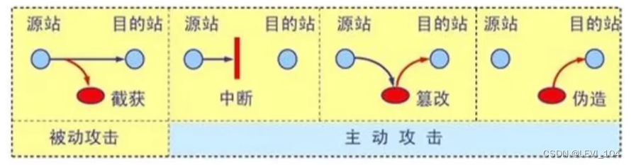

### 网络层--ARP欺骗

- ARP欺骗（ARP spoofing），又称ARP毒化（ARP poisoning）、ARP病毒、ARP攻击
- ARP欺骗可以造成的效果 
  - 可让攻击者获取局域网上的数据包甚至篡改数据包
  - 可让网络上特定电脑之间无法正常通信（例如网络执法官这样的软件）
  - 让送至IP地址的流量错误送到攻击者所取代的地方啊

!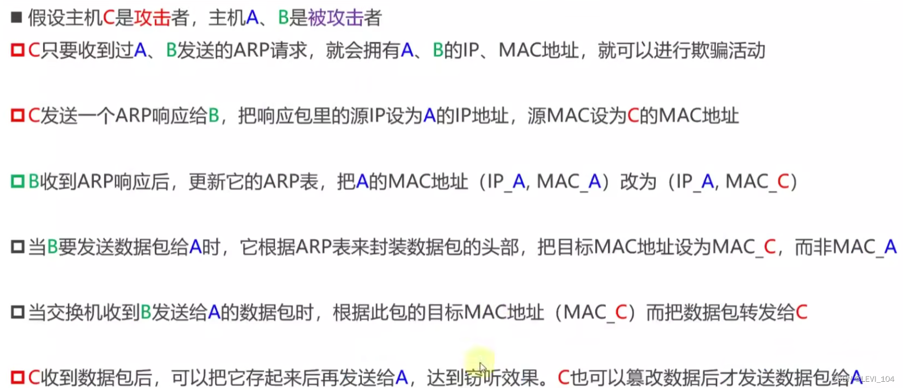

###  DoS、DDoS

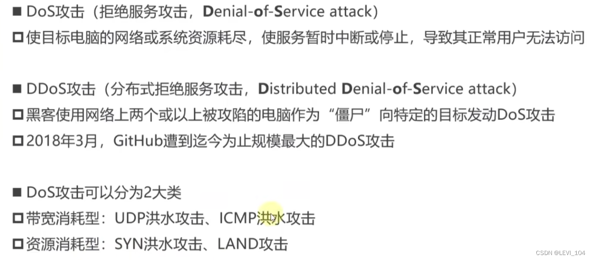

###  SYN洪水攻击

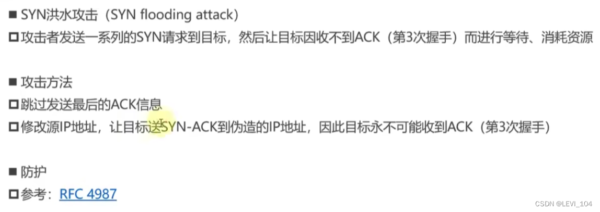

### LAND攻击

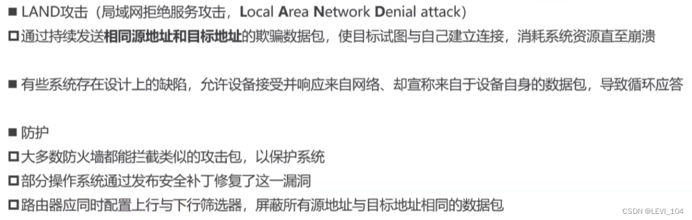

###  DoS、DDoS防御

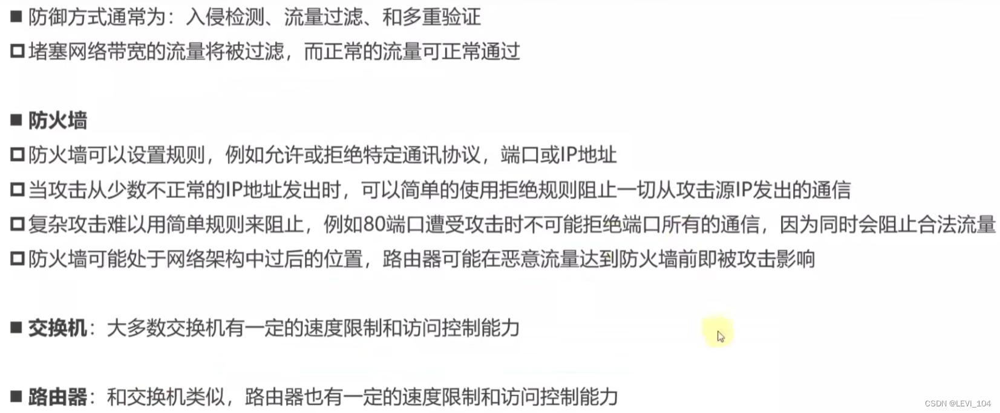

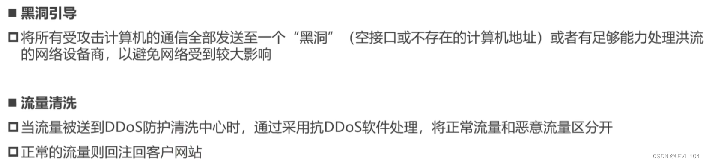

###  DNS劫持

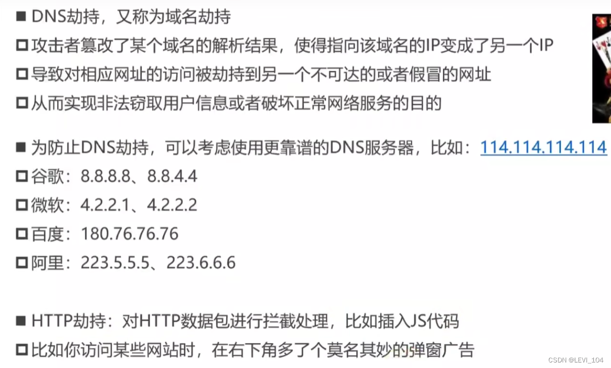

###  HTTP协议的安全问题

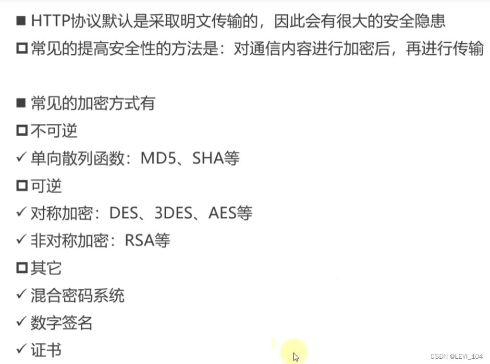

##  学习安全机制如下：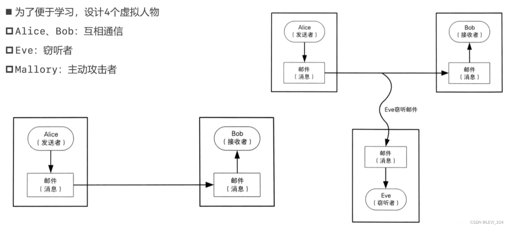

 如何防止被窃听？

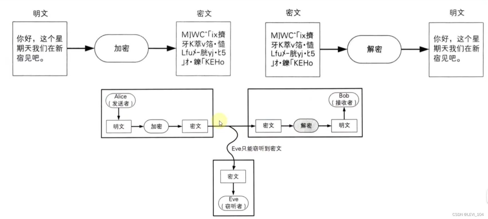

###  单向散列函数（One-way hash function）

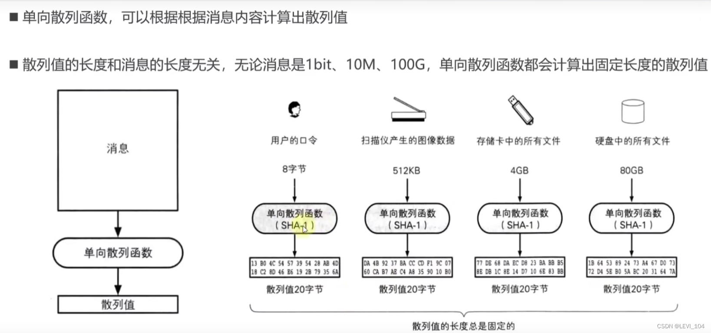

 特点

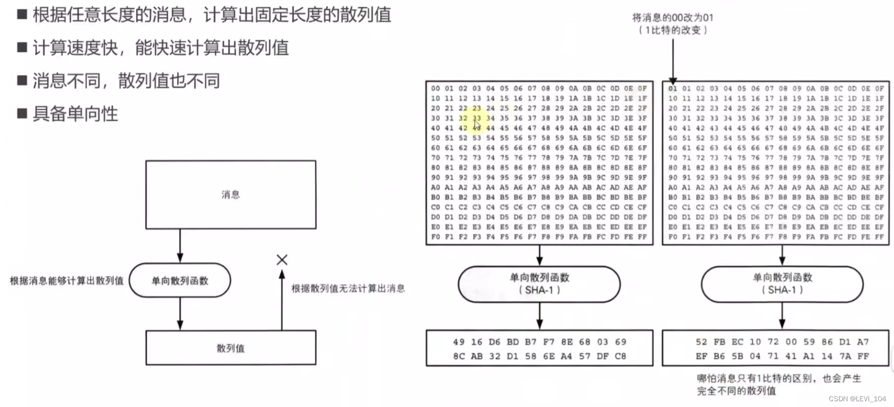

 称呼

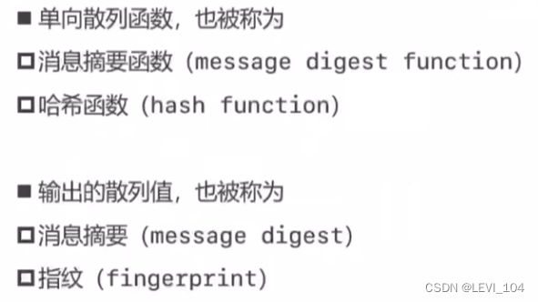

 解密

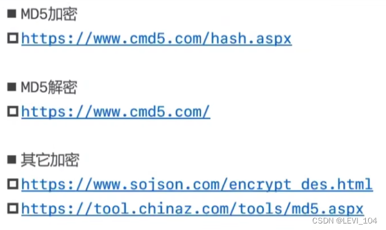

 常见的几种单向散列函数

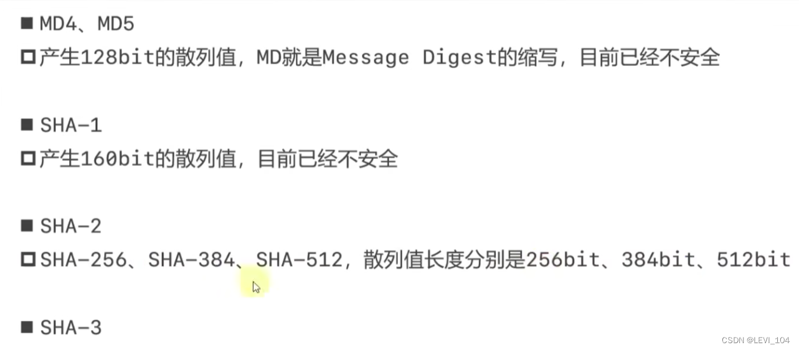

 应用：防止数据被篡改

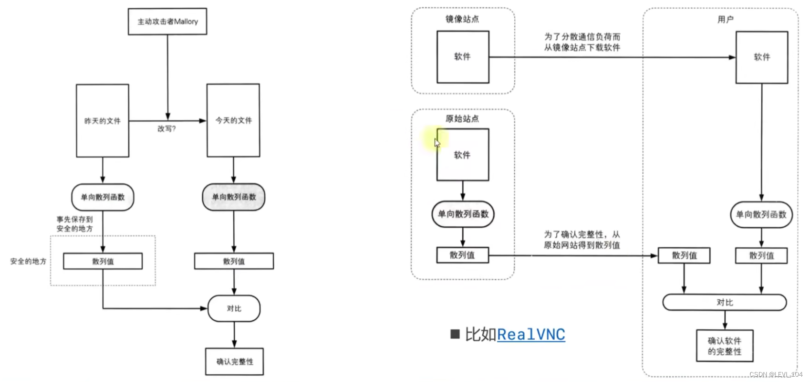