# （非）对称加密&数字证书

## 如何加密解密

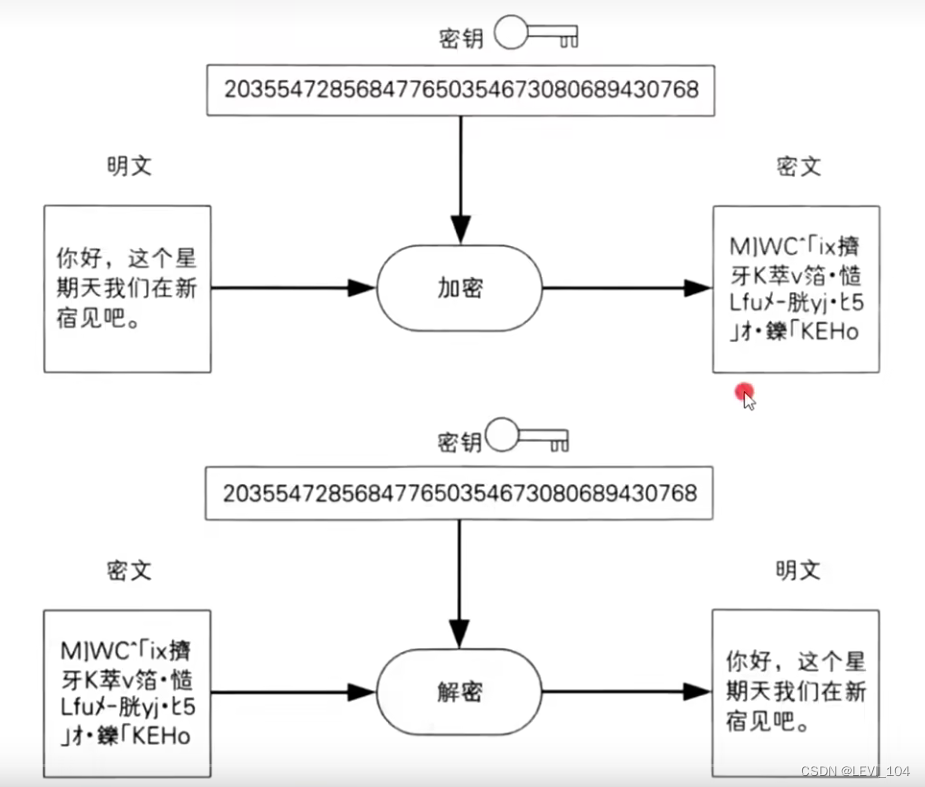

###  对称加密（对称密码）

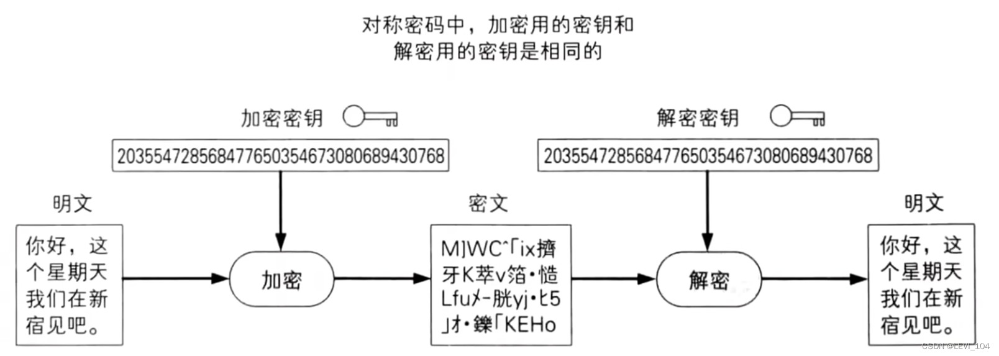

###  非对称加密（公钥密码）

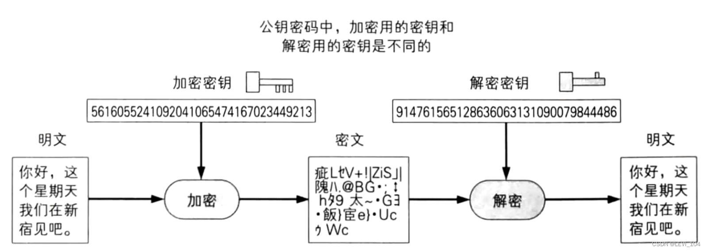

##  对称加密（Symmetric Cryptography）

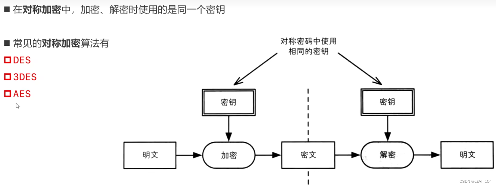

###  DES（Data Encryption Standard）

- DES是一种将64bit明文加密成64bit密文的对称加密算法，密钥长度是56bit
- 规格上来说，密钥长度是64bit，但每隔7bit就会设置一个用于错误检查的bit，因此密钥长度实质上是56bit
- 由于DES每次只能加密64bit的数据，遇到比较大的数据，就需要对DES加密进行迭代（反复）
- 目前已经可以在短时间内破解DES，所以不建议使用

### 3DES（Triple Data Encryption Algorithm）

- 3DES，将DES重复3次2所得到的一种密码算法，也叫三重DES 
  - 三重DES并不是进行三次DES加密（加密==>加密==>加密）
  - 而是加密==>解密==>加密
- 目前还被一些银行等机构使用，但处理速度不高，安全性逐渐暴露出问题

 3个密钥是不同的，也称为DES-EDE3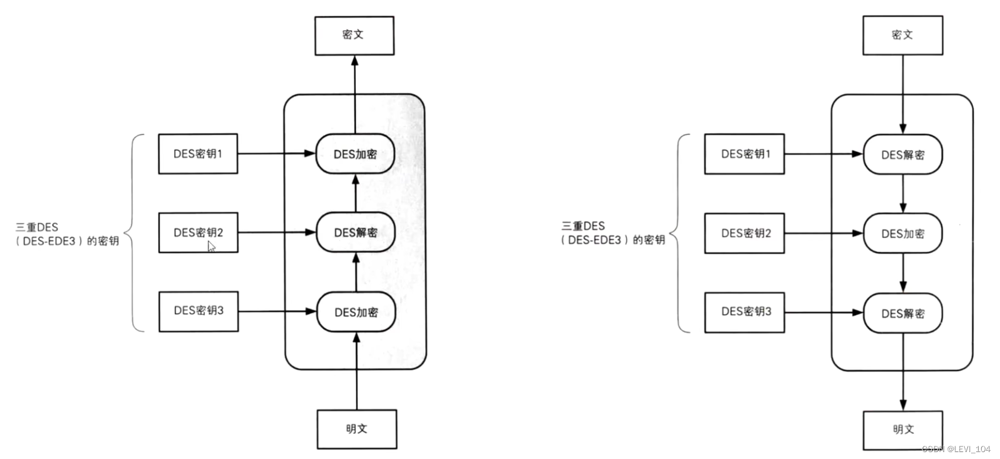

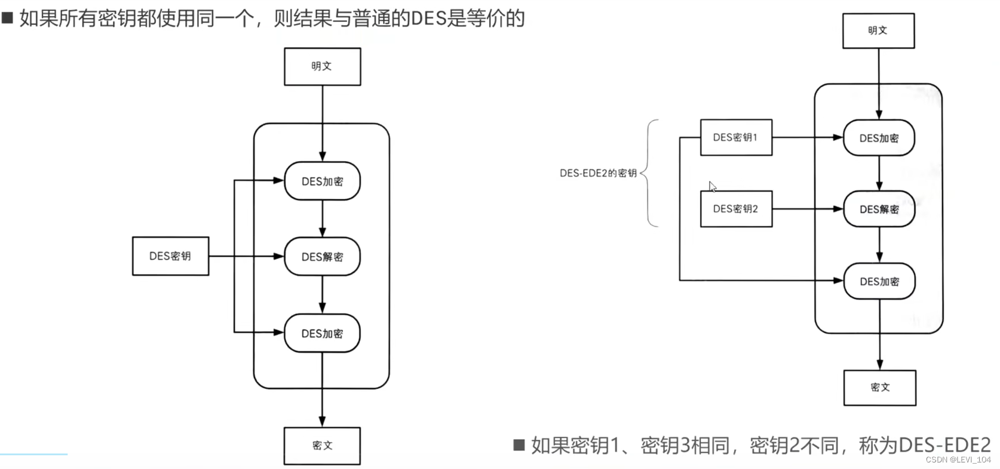

###  AES（Advanced Encryption Standard）

- 取代DES成为新标准的一种对称加密算法，又称Rijndael加密法
- AES的密钥长度有128、192、256三种
- 目前AES，已经逐步取代DES，3DES，成为首选的对称加密算法
- 一般来说，我们也不应该去使用任何自制的秘密算法。AES经过了全世界密码学家所进行的高品质验证工作

##  密钥配送问题

- 在使用对称加密时，一定会遇到密钥配送问题
- 如果Alice使用对称加密过的消息发送给了Bob 
  - 只有将密钥发送给Bob，Bob才能完成加密
  - 在发送密钥过程中：可能会被Eve窃取密钥；最后Eve也能完成解密

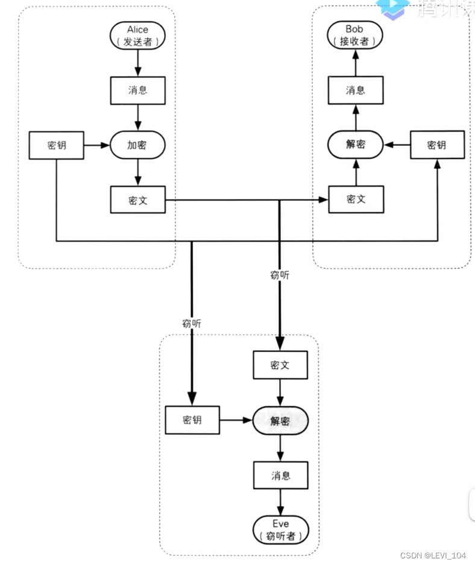

 解决密钥配送问题

- 有以下几种解决密钥配送的方法 
  - 事先共享密钥（比如私下共享）
  - 密钥分配中心（Key Distribution Center，简称KDC）
  - Diffie-Hellman密钥交换
  - 非对称加密

##  非对称加密（Asymmtric Cryptographic）

- 在非对称加密种，密钥分为加密密钥、解密密钥两种，它们并不是同一个密钥
- 加密密钥：一般是公开的，因此该密钥称为公钥（public key）。因此，非对称加密也被称为公钥密码（Public-key Cryptography）
- 解密密钥：由消息接收者自己报关，不能公开，因此也成为私钥（private key）

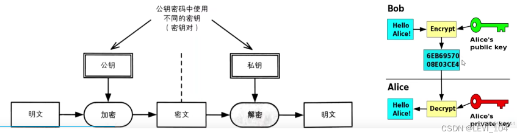

 公钥、私钥

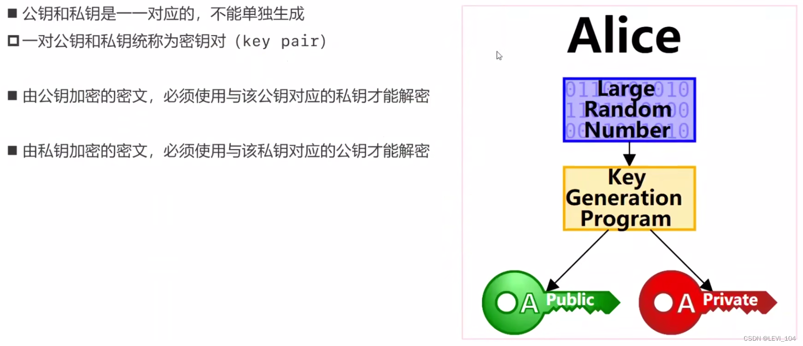

###  解决非对称密钥配送问题

- 由消息的接收者，生成一堆公钥私钥
- 将公钥发送给消息的发送者
- 消息的发送者使用公钥加密信息
- 非对称加密的加密解密速度比对称加密要慢

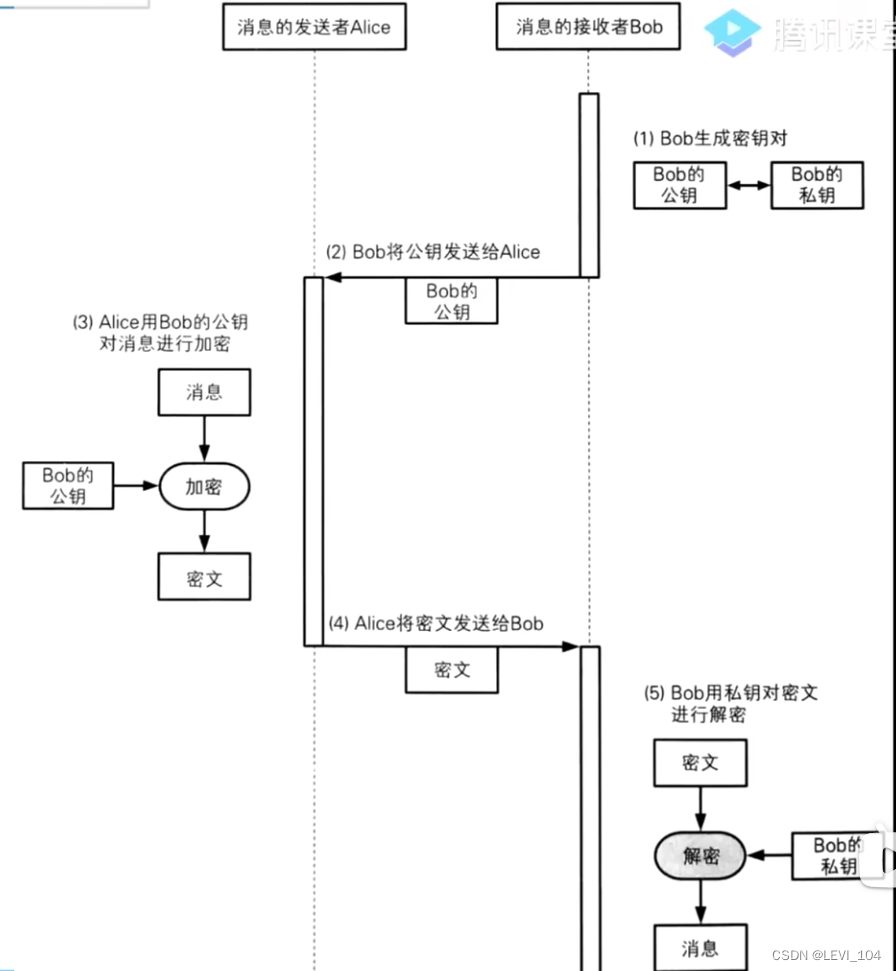

##  混合密码系统（Hybrid Cryptosystem）

- 对称加密的缺点：不能很好地解决密钥配送问题（密钥会被窃听）
- 非对称加密的缺点：加密解密速度慢
- 混合密码系统：是将对称加密和非对称加密的优势相结合的方法 
  - 解决了非对称加密速度慢的问题
  - 并通过非对称加密解决了对称加密的密钥配送的问题
- 网络上密码通信所使用SSL/TLS都运用了混合密码系统

###  混合密码-加密

- 会话密钥（session key）。为本子通信随机生成的临时密钥，作为对称加密的密钥，用于加密信息，提高速度
- 加密步骤（发送消息） 
  - 首先，消息发送者要拥有消息接收者的公钥
  - 生成会话密钥，作为对称加密的密钥，加密消息
  - 用消息接收者的公钥，加密会话密钥
  - 将钱步生成的加密结果，一并发送给密钥接收者
- 发送出去的内容包括 
  - 用会话密钥加密的消息（加密方法：对称加密）
  - 用公钥加密的会话密钥（加密方法：非对称加密）

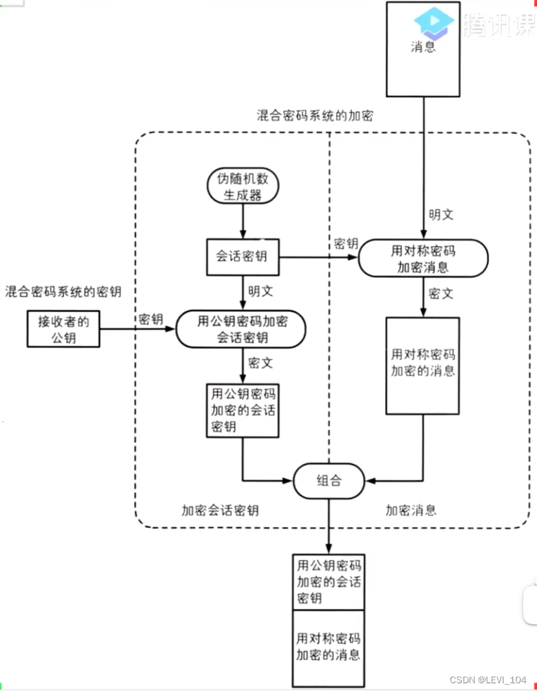

###  混合密码--解密

- 解密步骤 
  - 信息接收者用自己的私钥解密出会话密钥
  - 再用上一步解密出来的会话密钥，解密信息

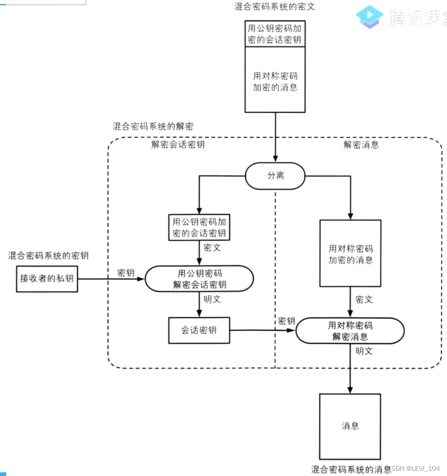