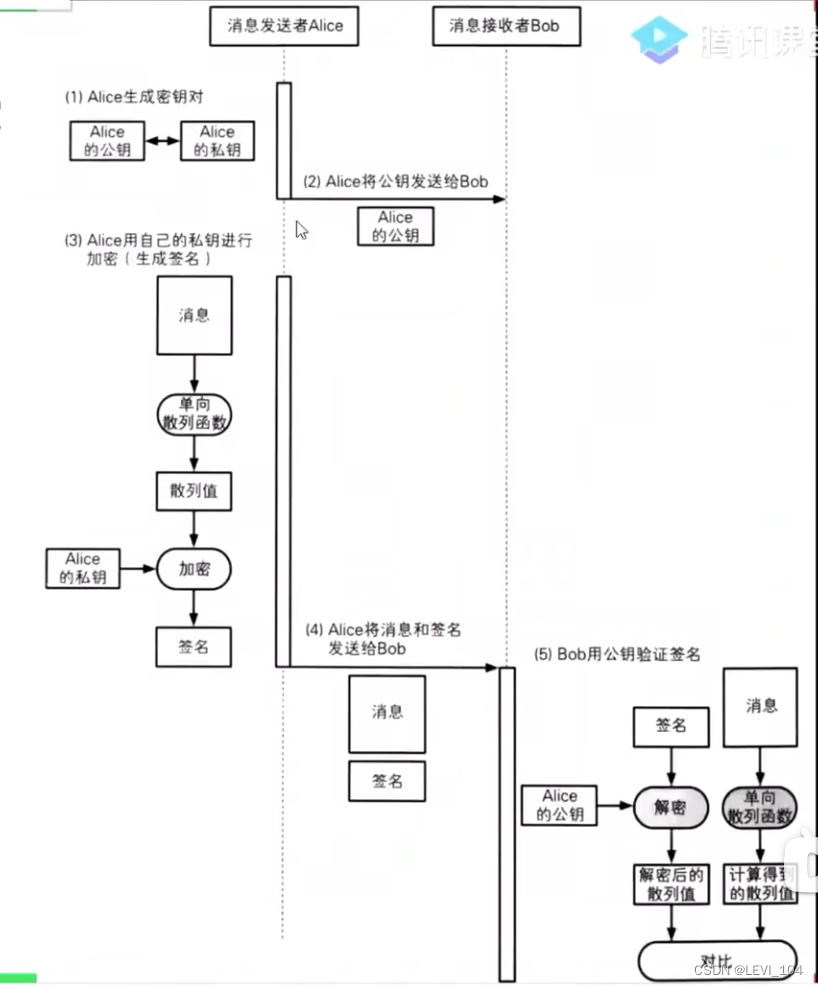

##  数字签名

- 在数字签名技术中，有以下两种行为 
  - 生成签名：由消息发送者完成，通过“签名密钥”生成
- 验证签名：由消息的接收者完成，同构“验证密钥”验证
- 如果能保证这个签名是消息发送者自己签名的呢？答案：用消息发送者的私钥进行签名

过程 

 改进

###  数字签名--疑惑

- 如果有人篡改了信息内容或者签名内容，会是什么结果？答案：签名验证失败，证明内容被篡改了
- 数字签名不能保证机密性？答案：数字签名的作用不是为了保证机密性，而是为了能够识别内容有没有被篡改
- 数字签名的作用 
  - 确认消息的完整性
  - 识别消息是否被篡改
  - 防止消息发送人否认

## 数字证书 

###  公钥的合法性

如果遭遇了中间人攻击，那么公钥可能是伪造的。如何验证公钥的合法性呢？使用数字证书！ 

###  证书

- 说到证书，首先联想到的是驾驶证、毕业证、英语四六级证等待，都是由权威机构认证的
- 密码学中的证书，全称叫公钥证书（Public-key Certificate， PKC），跟驾驶证类似 
  - 里面由姓名、邮箱等个人信息，以及此人的公钥
  - 并由认证机构（Certificate Authority， CA）施加数字签名
- CA就是能够认定“公钥确实属于此人”并能够生成数字签名的个人或者组织 
  - 由国际性组织、政府设立的组织
  - 有通过提供认证服务来盈利的企业
  - 个人也可以成立认证机构

###  证书使用

###  证书的注册和下载

###  查看Windows已经信任的证书

