# 体系结构

## 因特网概述

### 因特网的标准化工作

- 因特网的标准化工作对因特网的发展起到了非常重要的作用。
- 因特网在制定其标准上的一个很大的特点是面向公众。
  - 因特网所有的RFC(Request For Comments)技术文档都可从因特网上免费下载：(http://www.ietf.org/rfc.html)
  - 任何人都可以随时用电子邮件发表对某个文档的意见或建议。
- 因特网协会ISOC是一个国际性组织，它负责对因特网进行全面管理，以及在世界范围内促进其发展和使用。
  - 因特网体系结构委员会IAB，负责管理因特网有关协议的
  - 因特网工程部IETF，负责研究中短期工程问题，主要针对协议的开发和标准化
  - 因特网研究部IRTF，从事理论方面的研究和开发一些需要长期考虑的问题
- 制订因特网的正式标准要经过以下4个阶段:
  - 因特网草案(在这个阶段还不是RFC文档)
  - 建议标准(从这个阶段开始就成为RFC文档)
  - 草案标准
  - 因特网标准

### 因特网的组成

- 边缘部分：由所有连接在因特网上的主机组成。这部分是用户直接使用的，用来进行通信（传送数据、音频或视频）和资源共享。

- 核心部分：由大量网络和连接这些网络的路由器组成。这部分是为边缘部分提供服务的（提供连通性和交换)。

## 三种交换方式

### 电路交换

- 电话交换机接通电话线的方式称为电路交换;

- 从通信资源的分配角度来看，交换(Switching)就是按照某种方式动态地分配传输线路的资源;

- 电路交换的三个步骤
  - 建立连接（分配通信资源)
  - 通话（一直占用通信资源)
  - 释放连接（归还通信资源)

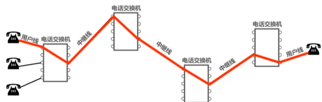

### 分组交换

### 报文交换

被分组交换取代

### 三种交换方式比较

## 计算机网络的分类

- 按分类技术
  - 电路交换网络
  - 报文交换网络
  - 分组交换网络

- 按使用者
  - 公用网
  - 专用网
- 按传输介质
  - 有线网络
  - 无线网络
- 按覆盖范围
  - 广域网WAN
  - 城域网MAN
  - 局域网LAN
  - 个域网PAN
- 按拓扑结构
  - 总线型网络
  - 星型网络
  - 环型网络
  - 网状网络

## 性能指标

### 速率

一个厂家定的250G 的硬盘，电脑显示只有232.8G，原因：厂家是用10^9定义一个G，而计算机用2^30定义一个G，(250 * 10^9) / 2^30 大约等于232.8G

连接在计算机网络上的主机在数字信道上传送比特的速率，也称为比特率或数据率。

**例题1**

**例题2**

### 带宽

- 带宽在模拟信号系统中的意义：信号所包含的各种不同频率成分所占据的频率范围。单位: Hz(kHz，MHz，GHz)
- 带宽在计算机网络中的意义：用来表示网络的通信线路所能传送数据的能力，因此网络带宽表示在单位时间内从网络中的某一点到另一点所能通过的“最高数据率”。单位:b/s (kb/s,Mb/s, Gb/s,Tb/s)

其实，“带宽”的这两种表述之间有着密切的联系。一条通信线路的“频带宽度”越宽,其所传输数据的“最高数据率”也越高。

### 吞吐量

- 吞吐量表示在单位时间内通过某个网络(或信道、接口)的数据量。
- 吞吐量被经常用于对现实世界中的网络的一种测量，以便知道实际上到底有多少数据量能够通过网络。
- 吞吐量受网络的带宽或额定速率的限制。

比如：一个拥有1Gb/s的以太网，受到吞吐量的影响，就只有700Mb/s

### 时延

**例题1**

数据块长度为100 MB,信道带宽为1 Mb/s,传送距离为1000 km,计算发送时延和传播时延，假设传播介质是光纤

**例子2**

数据块长度为1B,信道带宽为1 Mb/s,传送距离为1000 km,计算发送时延和传播时延，假设传播介质是光纤

### 时延宽带积

- 若发送端连续发送数据，则在所发送的第一个比特即将到达终点时，发送端就已经发送了时延带宽积个比特;

- 链路的时延带宽积又称为以比特为单位的链路长度。

### 往返时间

- 在许多情况下，因特网上的信息不仅仅单方向传输，而是双向交互;

- 我们有时很需要知道双向交互一次所需的时间;
- 因此，往返时间RTT(Round-Trip Time)也是一个重要的性能指标。

### 利用率

- 分类

  - 信道利用率：用来表示某信道有百分之几的时间是被利用的（有数据通过)。

  - 网络利用率：全网络的信道利用率的加权平均。

- 根据排队论，当某信道的利用率增大时，该信道引起的时延也会迅速增加。因此，信道利用率并非越高越好;

- 如果令D0表示网络空闲时的时延，D表示网络当前的时延，那么在适当的假定条件下，可以用下面的简单公式来表示D、D0和利用率U之间的关系:
  - 当网络的利用率达到50%时，时延就要加倍;
  - 当网络的利用率超过50%时，时延急剧增大;
  - 当网络的利用率接近100%时，时延就趋于无穷大;
  - 因此，一些拥有较大主干网的ISP通常会控制它们的信道利用率不超过50%。如果超过了，就要准备扩容，增大线路的带宽。

$$
D={D_0 \over 1-U}
$$

- 也不能使信道利用率太低，这会使宝贵的通信资源被白白浪费。应该使用一些机制，可以根据情况动态调整输入到网络中的通信量，使网络利用率保持在一个合理的范围内。

### 丢包率

- 丢包率即分组丢失率，是指在一定的时间范围内，传输过程中丢失的分组数量与总分组数量的比率。
- 丢包率具体可分为接口丢包率、结点丢包率、链路丢包率、路径丢包率、网络丢包率等。
- 丢包率是网络运维人员非常关心的一个网络性能指标，但对于普通用户来说往往并不关心这个指标,因为他们通常意识不到网络丢包。
- 分组丢失主要有两种情况
  - 分组在传输过程中出现误码，被结点丢弃;
  - 分组到达一台队列已满的分组交换机时被丢弃;在通信量较大时就可能造成网络拥塞。

- 因此，丢包率反映了网络的拥塞情况:
  - 无拥塞时路径丢包率为0
  - 轻度拥塞时路径丢包率为1%~4%
  - 严重拥塞时路径丢包率为5%~15%

## 专用术语

- 实体

  - 实体：任何可发送或接收信息的硬件或软件进程。

  - 对等实体：收发双方相同层次中的实体。

- 协议
  - 指控制两个对等实体进行逻辑通信的规则的集合。
  - 语法：定义所交换信息的格式
  - 语义︰定义收发双方所要完成的操作
  - 同步：定义收发双方的时序关系

- 服务
  - 在协议的控制下，两个对等实体间的逻辑通信使得本层能够向上一层提供服务。
  - 要实现本层协议，还需要使用下面一层所提供的服务。
  - 协议是“水平的”，服务是“垂直的”。
  - 服务访问点：在同一系统中相邻两层的实体交换信息的逻辑接口，用于区分不同的服务类型
    - 数据链路层的服务访问点为帧的“类型”字段。
    - 网络层的服务访问点为IP数据报首部中的“协议字段”。
    - 运输层的服务访问点为“端口号”。
  - 服务原语：上层使用下层所提供的服务必须通过与下层交换一些命令，这些命令称为服务原语。
  - 协议数据单元PDU： 对等层次之间传送的数据包称为该层的协议数据单元。
  - 服务数据单元SDU同一系统内，层与层之间交换的数据包称为服务数据单元。
  - 多个SDU可以合成为一个PDU;一个SDU也可划分为几个PDU。

## 体系结构习题课

例题1

例题2

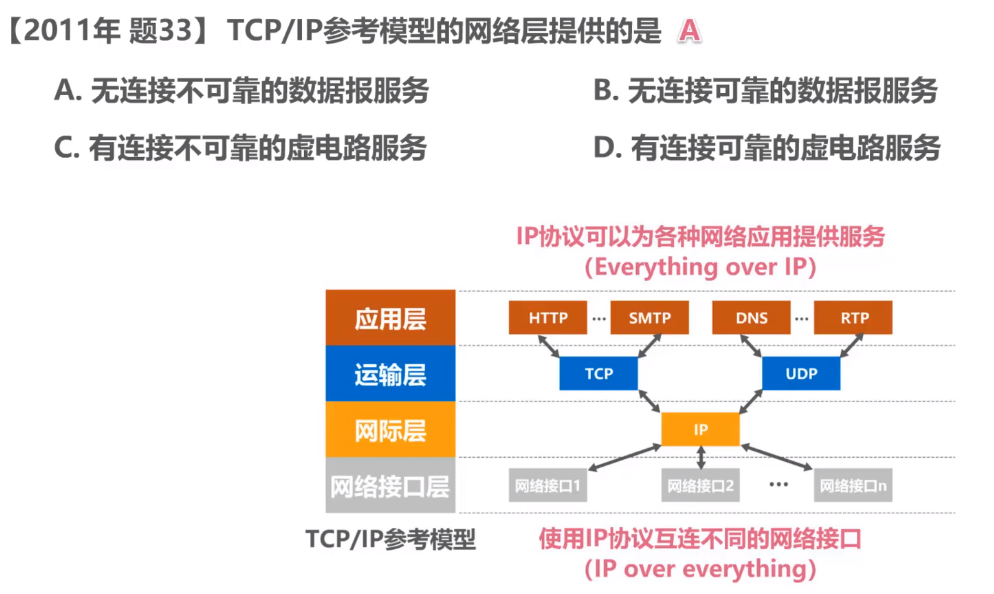

例题3

例题4

例题5 

例题6

例题7

例题8

例题9

习题10

习题11

习题12

习题13

习题14

习题15

# 物理层

## 传输媒体

**导引型**

- 同轴电缆
  - 基带同轴电缆（(50欧姆)：数字传输，过去用于局域网
  - 宽带同轴电缆(75欧姆)：模拟传输，目前主要用于有线电视
  - 方便，随着集线器的出现,在局域网领域模拟传输，目前主要用于有线电视

- 双绞线

- 光纤
  - 光纤直径
    - 多模光纤:50微米，62.5微米
    - 单模光纤:9微米
  - 包层直径125微米
  - 工作波长
    - 0.85微米（衰减较大)
    - 1.30微米（衰减较小)
    - 1.55微米（衰减较小)
  - 光纤的优点
    - 通信容量大(25000~30000GHz的带宽)
    - 传输损耗小，远距离传输时更加经济。
    - 抗雷电和电磁干扰性能好。这在大电流脉冲干扰的环境下尤为重要
    - 无串音干扰，保密性好，不易被窃听。
    - 体积小，重量轻。
  - 光纤的缺点：割接需要专用设备

- 电力线

**非导引型**

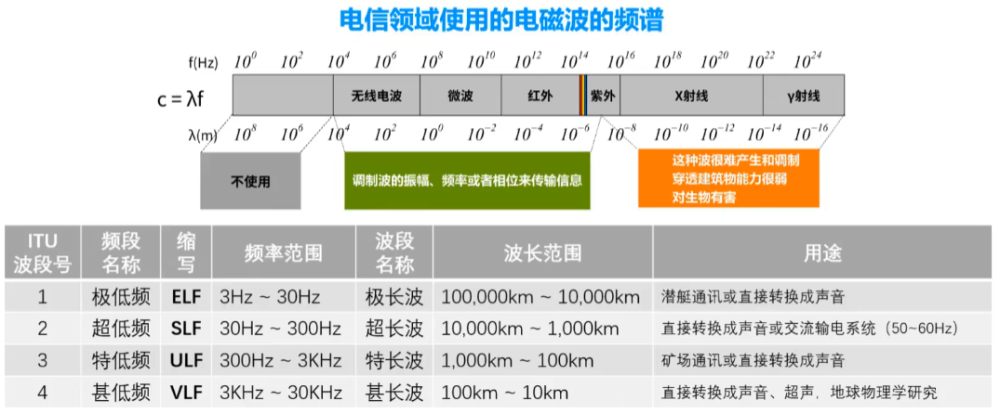

- 无限电波

- 微波

- 红外线

- 可见光：LIFI

## 传输方式

串行和并行

同步和异步

单工、半双工、全双工

## 编码和调制

**常用编码**

**例题**

**基本调制方法**

- 使用基本调制方法，1个码元只能包含1个比特信息。
- 因为频率和相位是相关的，即频率是相位随时间的变化率。所以一次只能调制频率和相位两个中的一个。
- 通常情况下，相位和振幅可以结合起来一起调制，称为正交振幅调制QAM。

**混合调制举例：正交振幅调制QAM**

## 信道的极限容量

### 奈氏准则

奈氏准则：在假定的理想条件下，为了避免码间串扰，码元传输速率是有上限的。

数据传输速率=波特率(码元传输速率)X每个码元所携带的信息量

- 理想低通信道的最高码元传输速率=2W Baud = 2W码元/秒

- 理想带通信道的最高码元传输速率=W Baud =W码元/秒
  - w:信道带宽（单位为Hz)
  - Baud:波特，即码元/秒

- 码元传输速率又称为波特率、调制速率、波形速率或符号速率。它与比特率有一定关系:
  - 当1个码元只携带1比特的信息量时，则波特率（码元/秒)与比特率（比特/秒）在数值上是相等的
  - 当1个码元携带n比特的信息量时，则波特率转换成比特率时，数值要乘以n。
- 要提高信息传输速率（比特率)，就必须设法使每一个码元能携带更多个比特的信息量。这需要采用多元制。
- 实际的信道所能传输的最高码元速率，要明显低于奈氏准则给出的这个上限数值。

> 只要采用更好的调制方法，让码元可以携带更多的比特，岂不是可以无限制地提高信息的传输速率?
>
> 笞案是否定的。因为信道的极限信息传输速率还要受限于实际的信号在信道中传输时的信噪比。

### 香农公式

香农公式：带宽受限且有高斯白噪声干扰的信道的极限信息传输速率。
$$
c=W*log_2(1+{S \over N})
$$

- C:信道的极限信息传输速率(单位:b/s)
- W:信道带宽（单位:Hz)
- S:信道内所传信号的平均功率
- N:信道内的高斯噪声功率
- S/N:信噪比，使用分贝(dB)作为度量单位

- 信道带宽或信道中信噪比越大，信息的极限传输速率越高。

- 在实际信道上能够达到的信息传输速率要比该公式的极限传输速率低不少。这是因为在实际信道中，信号还要受到其他一些损伤，如各种脉冲干扰、信号在传输中的衰减和失真等，这些因素在香农公式中并未考虑。

> 在信道带宽一定的情况下，根据奈氏准则和香农公式，要想提高信息的传输速率就必须采用多元制(更好的调制方法)和努力提高信道中的信噪比。
>
> 自从香农公式发表后，各种新的信号处理和调制方法就不断出现，其目的都是为了尽可能地接近香农公式给出的传输速率极限。
>

### 例题

不管题目给出的调制技术多么“牛”或对于我们而言有多陌生，这都不会影响我们解题。我们只需关心这种调制技术可以调制出多少个不同的基本波形(码元)即可。

1

2

3

 4

## 物理层习题课

1

2

3

4

5

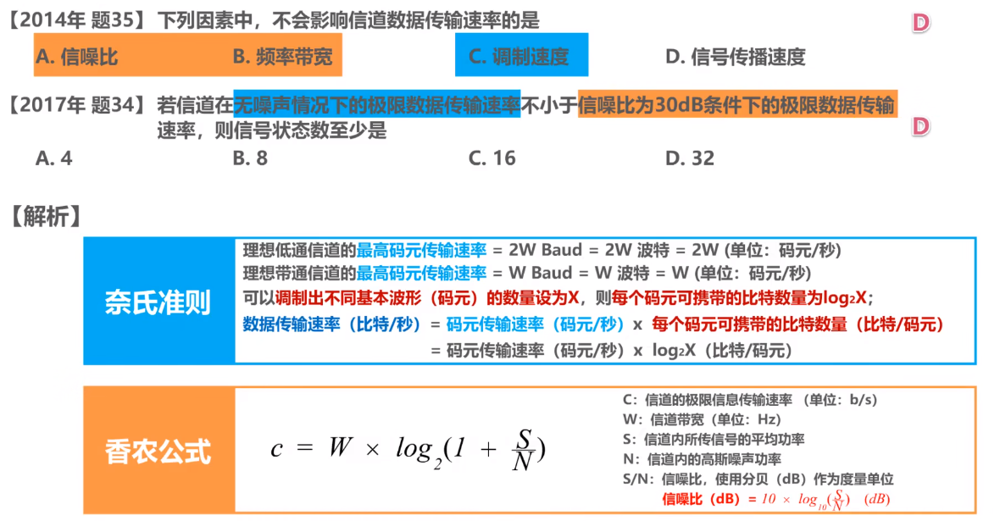

6

7

# 数据链路层

## 概述

- 链路(Link)就是从一个结点到相邻结点的一段物理线路，而中间没有任何其他的交换结点。
- 数据链路(Data Link)是指把实现通信协议的硬件和软件加到链路上，就构成了数据链路。
- 数据链路层以帧为单位传输和处理数据。

封装成帧

差错检测

可靠传输： 尽管误码是不能完全避免的,但若能实现发送方发送什么,接收方就能收到什么，就称为可靠传输。

使用广播信道的数据链路层传输信号：

但是如果发生碰撞怎么办呢？

交换式局域网

## 封装成帧

- 封装成帧是指数据链路层给上层交付的协议数据单元添加帧头和帧尾使之成为帧。
  - 帧头和帧尾中包含有重要的控制信息。
  - 帧头和帧尾的作用之一就是帧定界。

## 透明传输

- 透明传输是指数据链路层对上层交付的传输数据没有任何限制，就好像数据链路层不存在一样。

- 面向字节的物理链路使用字节填充（(或称字符填充)的方法实现透明传输。
- 面向比特的物理链路使用比特填充的方法实现透明传输。
- 为了提高帧的传输效率，应当使帧的数据部分的长度尽可能大些。
- 考虑到差错控制等多种因素，每一种数据链路层协议都规定了帧的数据部分的长度上限，即最大传送单元MTU(Maximum Transfer Unit) 。

转译字符是一种特殊的控制字符，长度1字节，十进制值=27

习题

## 差错检测

- 实际的通信链路都不是理想的，比特在传输过程中可能会产生差错:1可能会变成0,而0也可能变成1。这称为比特差错。
- 在一段时间内，传输错误的比特占所传输比特总数的比率称为误码率BER(Bit Error Rate)。
- 使用差错检测码来检测数据在传输过程中是否产生了比特差错，是数据链路层所要解决的重要问题之一。

- 奇偶校验
  - 在待发送的数据后面添加1位奇偶校验位，使整个数据（包括所添加的校验位在内)中“1”的个数为奇数(奇校验)或偶数（偶校验)。
  - 如果有奇数个位发生误码，则奇偶性发生变化，可以检查出误码;
  - 如果有偶数个位发生误码，则奇偶性不发生变化，不能检查出误码（漏检);

- 循环冗余校验CRC
  - 收发双方约定好一个生成多项式G(x);
  - 发送方基于待发送的数据和生成多项式计算出差错检测码（冗余码)，将其添加到待传输数据的后面一起传输
  - 接收方通过生成多项式来计算收到的数据是否产生了误码;

CRC举例1

CRC举例2

- 检错码只能检测出帧在传输过程中出现了差错，但并不能定位错误，因此无法纠正错误。
- 要想纠正传输中的差错，可以使用冗余信息更多的纠错码进行前向纠错。但纠错码的开销比较大，在计算机网络中较少使用。
- 循环冗余校验CRC有很好的检错能力（漏检率非常低)，虽然计算比较复杂，但非常易于用硬件实现，因此被广泛应用于数据链路层。
- 在计算机网络中通常采用我们后续课程中将要讨论的检错重传方式来纠正传输中的差错，或者仅仅是丢弃检测到差错的帧，这取决于数据链路层向其上层提供的是可靠传输服务还是不可靠传输服务。

## 可靠传输

- 使用差错检测技术（例如循环冗余校验CRC)，接收方的数据链路层就可检测出帧在传输过程中是否产生了误码(比特错误)。
- 数据链路层向上层提供的服务类型
  - 不可靠传输服务:仅仅丢弃有误码的帧，其他什么也不做;
  - 可靠传输服务:想办法实现发送端发送什么，接收端就收到什么。
- 一般情况下，有线链路的误码率比较低，为了减小开销，并不要求数据链路层向上提供可靠传输服务。即使出现了误码，可靠传输的问题由其上层处理。
- 无线链路易受干扰，误码率比较高，因此要求数据链路层必须向上层提供可靠传输服务。
- 比特差错只是传输差错中的一种。
- 从整个计算机网络体系结构来看，传输差错还包括分组丢失、分组失序以及分组重复。
- 分组丢失、分组失序以及分组重复这些传输差错，一般不会出现在数据链路层，而会出现在其上层。
- 可靠传输服务并不仅局限于数据链路层，其他各层均可选择实现可靠传输。

- 可靠传输的实现比较复杂，开销也比较大，是否使用可靠传输取决于应用需求。

### 停止等待协议SW

- 接收方收不到数据分组，就不会发送ACK或NAK。如果不采取其他措施，发送方就会一直处于等待接收方ACK或NAK的状态。
- 为解决该问题，可以在发送方发送完一个数据分组时，启动一个超时计时器。若到了超时计时器所设置的重传时间而发送方仍收不到接收方的任何ACK或NAK，则重传原来的数据分组，这就叫做超时重传。
- 一般可将重传时间选为略大于“从发送方到接收方的平均往返时间”

- 为避免分组重复这种传输错误，必须给每个分组带上序号。

- 对于停止-等待协议，由于每发送一个数据分组就停止等待,只要保证每发送一个新的数据分组，其发送序号与上次发送的数据分组的序号不同就可以了，因此用一个比特来编号就够了。

注意事项

- 接收端检测到数据分组有误码时，将其丢弃并等待发送方的超时重传。但对于误码率较高的点对点链路，为使发送方尽早重传，也可给发送方发送NAK分组
- 为了让接收方能够判断所收到的数据分组是否是重复的，需要给数据分组编号。由于停止-等待协议的停等特性，只需1个比特编号就够了，即编号0和1.
- 为了让发送方能够判断所收到的ACK分组是否是重复的，需要给ACK分组编号，所用比特数量与数据分组编号所用比特数量一样。数据链路层一般不会出现ACK分组迟到的情况，因此在数据链路层实现停止-等待协议可以不用给ACK分组编号。

- 超时计时器设置的重传时间应仔细选择。一般可将重传时间选为略大于“从发送方到接收方的平均往返时间”。
  - 在数据链路层点对点的往返时间比较确定，重传时间比较好设定。
  - 然而在运输层，由于端到端往返时间非常不确定，设置合适的重传时间有时并不容易。

信道利用率

- 当往返时延RTT远大于数据帧发送时延To时（例如使用卫星链路)，信道利用率非常低。
- 若出现重传，则对于传送有用的数据信息来说，信道利用率还要降低。

- 为了克服停止-等待协议信道利用率很低的缺点，就产生了另外两种协议，即后退N帧协议GBN和选择重传协议SR,

例题

此协议常被成为：自动请求重传ARQ

### 回退N帧协议GBN

题目

- 回退N帧协议在流水线传输的基础上利用发送窗口来限制发送方连续发送数据分组的数量。是一种连续ARQ协议。

- 在协议的工作过程中发送窗口和接收窗口不断向前滑动,因此这类协议又称为滑动窗回协议。
- 由于回退N帧协议的特性,当通信线路质量不好时,其信道利用率并不比停止:等待协议高。

### 选择重传协议SR

- 回退N帧协议的接收窗口尺寸WR只能等于1，因此接收方只能按序接收正确到达的数据分组。
- 一个数据分组的误码就会导致其后续多个数据分组不能被接收方按序接收而丢弃（尽管它们无乱序和误码)。这必然会造成发送方对这些数据分组的超时重传，显然这是对通信资源的极大浪费。
- 为了进一步提高性能，可设法只重传出现误码的数据分组。因此，接收窗口的尺寸WR不应再等于1(而应大于1)，以便接收方先收下失序到达但无误码并且序号落在接收窗口内的那些数据分组，等到所缺分组收齐后再一并送交上层。这就是选择重传协议。
- 选择重传协议为了使发送方仅重传出现差错的分组，接收方不能再采用累积确认，而需要对每个正确接收到的数据分组进行逐一确认!

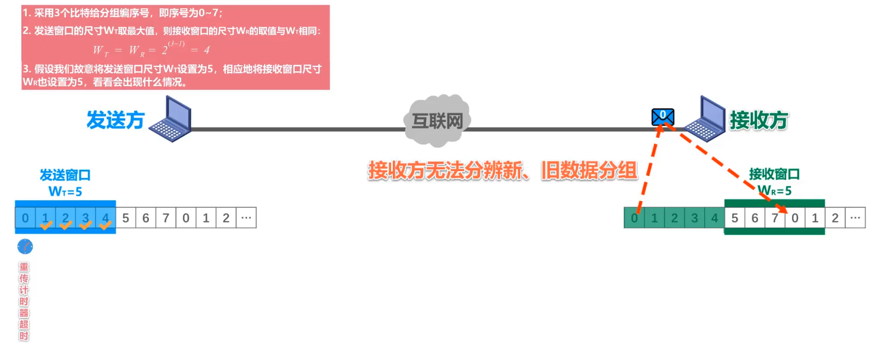

例题

 

## 点对点协议PPP

- 点对点协议PPP(Point-to-Point Protocol)是目前使用最广泛的点对点数据链路层协议。
- PPP协议是因特网工程任务组IETF在1992年制定的。经过1993年和1994年的修订，现在的PPP协议已成为因特网的正式标准[RFC1661,RFC1662].

## 媒体接入控制

共享信道要着重考虑的一个问题就是如何协调多个发送和接收站点对一个共享传输媒体的占用，即媒体接入控制MAC(Medium Access Control)。

随着技术的发展，交换技术的成熟和成本的降低，具有更高性能的使用点对点链路和链路层交换机的交换式局域网在有线领域已完全取代了共享式局域网，但由于无线信道的广播天性，无线局域网仍然使用的是共享媒体技术。

### 静态划分信道

- 复用(Multiplexing）是通信技术中的一个重要概念。复用就是通过一条物理线路同时传输多路用户的信号。
- 当网络中传输媒体的传输容量大于多条单一信道传输的总通信量时，可利用复用技术在一条物理线路上建立多条通信信道来充分利用传输媒体的带宽。

#### 频分复用FDM

频分复用的所有用户同时占用不同的频带资源并行通信。

#### 时分复用TDM

时分复用的所有用户在不同的时间占用同样的频带宽度。

#### 波分复用WDM

#### 码分复用CDM

- 码分复用CDM是另一种共享信道的方法。实际上，由于该技术主要用于多址接入，人们更常用的名词是码分多址CDMA(Code Division Multiple Access)。
- 同理，频分复用FDM和时分复用TDM同样可用于多址接入，相应的名词是频分多址FDMA(Frequency Division Multiple Access)和时分多址TDMA(Time Division Multiple Access)。
- 在本课程中，我们不严格区分复用与多址的概念。可简单理解如下:
  - 复用是将单一媒体的频带资源划分成很多子信道，这些子信道之间相互独立，互不干扰。从媒体的整体频带资源上看，每个子信道只占用该媒体频带资源的一部分。
  - 多址（更确切地应该称为多点接入）处理的是动态分配信道给用户。这在用户仅仅暂时性地占用信道的应用中是必须的，而所有的移动通信系统基本上都属于这种情况。相反，在信道永久性地分配给用户的应用中，多址是不需要的(对于无线广播或电视广播站就是这样)。
  - 某种程度上，FDMA、TDMA、CDMA可以分别看成是FDM、TDM、CDM的应用。

- 与FDM和TDM不同，CDM的每一个用户可以在同样的时间使用同样的频带进行通信。
- 由于各用户使用经过特殊挑选的不同码型，因此各用户之间不会造成干扰。
- CDM最初是用于军事通信的，因为这种系统所发送的信号有很强的抗干扰能力，其频谱类似于白噪声，不易被敌人发现。
- 随着技术的进步，CDMA设备的价格和体积都大幅度下降，因而现在已广泛用于民用的移动通信中。
- 使用CDMA的每一个站被指派一个唯一的m bit码片序列(Chip Sequence)。
  - 一个站如果要发送比特1，则发送它自己的m bit码片序列;
  - 一个站如果要发送比特0，则发送它自己的m bit码片序列的二进制反码;
  - 也成为直接序列扩频DSSS

例子

- 码片序列的挑选原则如下:
  - 分配给每个站的码片序列必须各不相同，实际常采用伪随机码序列.
  - 分配给每个站的码片序列必须相互正交(规格化内积为0)。

令向量S表示站S的码片序列，令向量T表示其他任何站的码片序列。两个不同站S和T的码片序列正交，就是向量S和T的规格化内积为0:

例子1

例子2

例子3

例子4

### 动态接入控制

#### 随机接入CSMA/CD

争用期（碰撞窗口）

最小帧长=争用期*数据传输速率

最大帧长

截断二进制指数退避算法

信道利用率

帧发送流程

帧接收流程

例题1

例题2

例题3

#### 随机接入CSMA/CA

 既然CSMA/CD协议已经成功地应用于使用广播信道的有线局域网，那么同样使用广播信道的无线局域网能不能也使用CSMA/CD协议呢?

- 在无线局域网中，仍然可以使用载波监听多址接入CSMA，即在发送帧之前先对传输媒体进行载波监听。若发现有其他站在发送帧，就推迟发送以免发生碰撞。
- 在无线局域网中，不能使用碰撞检测CD，原因如下:
  - 由于无线信道的传输条件特殊，其信号强度的动态范围非常大，无线网卡上接收到的信号强度往往会远远小于发送信号的强度（可能相差百万倍)。如果要在无线网卡上实现碰撞检测CD，对硬件的要求非常高。
  - 即使能够在硬件上实现无线局域网的碰撞检测功能，但由于无线电波传播的特殊性（存在隐蔽站问题)，进行碰撞检测的意义也不大。

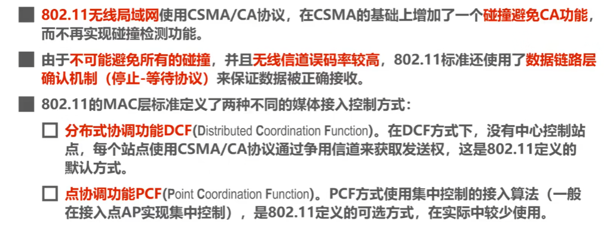

帧间间隔IFS（InterFrame Space）

CSMA/CA协议的工作原理

CSMA/CA协议的退避算法

CSMA/CA协议的信道预约和虚拟载波监听

例题1

例题2

例题3

 

### MAC地址

- 当多个主机连接在同一个广播信道上，要想实现两个主机之间的通信，则每个主机都必须有一个唯一的标识,即一个数据链路层地址;
- 在每个主机发送的帧中必须携带标识发送主机和接收主机的地址。由于这类地址是用于媒体接入控制MAC(Media Access Control)，因此这类地址被称为MAC地址;
  - MAC地址一般被固化在网卡（网络适配器）的电可擦可编程只读存储器EEPROM中，因此MAC地址也被称为硬件地址;
  - MAC地址有时也被称为物理地址。请注意:这并不意味着MAC地址属于网络体系结构中的物理层!
- 一般情况下，用户主机会包含两个网络适配器:有线局域网适配器（有线网卡)和无线局域网适配器（无线网卡)。每个网络适配器都有一个全球唯一的MAC地址。而交换机和路由器往往拥有更多的网络接口，所以会拥有更多的MAC地址。综上所述，严格来说，MAC地址是对网络上各接口的唯一标识，而不是对网络上各设备的唯一标识。

### IP地址 

例题

### ARP协议

### 集线器&交换机

使用集线器HUB在物理层扩展以太网

发送单播帧到目的主机

- 集线器
  - 早期以太网的互连设备
  - 工作在OSI体系结构的物理层
  - 对接收到的信号进行放大、转发
  - 使用集线器作为互连设备的以太网仍然属于共享总线式以太网。集线器互连起来的所有主机共享总线带宽，属于同一个碰撞域和广播域。
- 交换机
  - 目前以太网中使用最广泛的互连设备
  - 工作在OSI体系结构的数据链路层（也包括物理层)
  - 根据MAC地址对帧进行转发
  - 使用交换机作为互连设备的以太网，称为交换式以太网。交换机可以根据MAC地址过滤帧，即隔离碰撞域。
  - 交换机隔离碰撞域但不隔离广播域(VLAN除外)

### 交换机学习与转发

- 以太网交换机工作在数据链路层（也包括物理层)
- 以太网交换机收到帧后，在帧交换表中查找帧的目的MAC地址所对应的接口号，然后通过该接口转发帧。
- 以太网交换机是一种即插即用设备，刚上电启动时其内部的帧交换表是空的。随着网络中各主机间的通信，以太网交换机通过自学习算法自动逐渐建立起帧交换表。
- 每条记录都有自己的有效时间，到期自动删除!这是因为MAC地址与交换机接口的对应关系并不是永久性的!

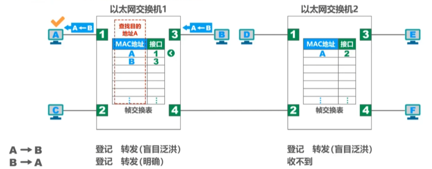

例题1

例题2

例题3

### 生成树协议STP

### 虚拟局域网VLAN

- 以太网交换机工作在数据链路层（也包括物理层)
- 使用一个或多个以太网交换机互连起来的交换式以太网，其所有站点都属于同一个广播域。
- 随着交换式以太网规模的扩大，广播域相应扩大。
- 巨大的广播域会带来很多弊端:
  - 广播风暴
  - 难以管理和维护
  - 潜在的安全问题

- 网络中会频繁出现广播信息
  - TCP/IP协议栈中的很多协议都会使用广播:
    - 地址解析协议ARP(已知IP地址，找出其相应的MAC地址)
    - 路由信息协议RIP(一种小型的内部路由协议)
    - 动态主机配置协议DHCP(用于自动配置IP地址)
  - NetBEUI: Widnows下使用的广播型协议
  - IPX/SPX: Novell网络的协议栈
  - Apple Talk: Apple公司的网络协议栈

### VLAN实现机制

- 交换机的端口类型有以下三种:
  - Access
  - Trunk
  - Hybrid
- 交换机各端口的缺省VLAN ID
  - 在思科交换机上称为Native VLAN，即本征VLAN。
  - 在华为交换机上称为Port VLAN ID，即端口VLAN ID，简记为PVID。

Hybrid

# 网络层

## 概述

- 网络层的主要任务是实现网络互连，进而实现数据包在各网络之间的传输。要实现网络层任务，需要解决以下主要问题:
  - 网络层向运输层提供怎样的服务（“可靠传输”还是“不可靠传输”)
  - 网络层寻址问题
  - 路由选择问题
- 因特网(Internet)是目前全世界用户数量最多的互联网，它使用TCP/IP协议栈。
- 由于TCP/IP协议栈的网络层使用网际协议IP，它是整个协议栈的核心协议，因此在TCP/IP协议栈中网络层常称为网际层。

## 两种服务

- 面向连接的虚电路服务
  - 可靠通信由网络来保证
  - 必须建立网络层的连接——虚电路VC(Virtual Circuit)
  - 通信双方沿着已建立的虚电路发送分组
  - 目的主机的地址仅在连接建立阶段使用，之后每个分组的首部只需携带一条虚电路的编号(构成虚电路的每一段链路都有一个虚电路编号)。
  - 这种通信方式如果再使用可靠传输的网络协议，就可使所发送的分组最终正确到达接收方(无差错按序到达、不丢失、不重复)。
  - 通信结束后，需要释放之前所建立的虚电路。
  - 很多广域分组交换网都使用面向连接的虚电路服务。例如，曾经的X.25和逐渐过时的帧中继FR、异步传输模式ATM等。

- 无连接的数据报服务
  - 可靠通信应当由用户主机来保证
  - 不需要建立网络层连接
  - 每个分组可走不同的路径
  - 每个分组的首部必须携带目的主机的完整地址
  - 这种通信方式所传送的分组可能误码、丢失、重复和失序。
  - 由于网络本身不提供端到端的可靠传输服务，这就使网络中的路由器可以做得比较简单，而且价格低廉（与电信网的交换机相比较)。
  - 因特网采用了这种设计思想，也就是将复杂的网络处理功能置于因特网的边缘(用户主机和其内部的运输层)，而将相对简单的尽最大努力的分组交付功能置于因特网核心。

## IPv4

### 概述

- 在TCP/IP体系中，IP地址是一个最基本的概念，我们必须把它弄清楚。
- IPv4地址就是给因特网(Internet)上的每一台主机(或路由器）的每一个接口分配一个在全世界范围内是唯一的32比特的标识符。
- IP地址由因特网名字和数字分配机构ICANN(Internet Corporation for Assigned Names and Numbers)进行分配。
  - 我国用户可向亚太网络信息中心APNIC(Asia Pacific Network Information Center)申请IP地址，需要缴费。
  - 2011年2月3日，互联网号码分配管理局IANA(由ICANN行使职能）宣布，IPv4地址已经分配完毕。
  - 我国在2014至2015年也逐步停止了向新用户和应用分配IPv4地址。同时全面开展商用部署IPv6。
- lPv4地址的编址方法经历了如下三个历史阶段:

- 32比特的IPv4地址不方便阅读、记录以及输入等，因此IPv4地址采用点分十进制表示方法以方便用户使用。

### 分类编址

A类

B类

C类

练习1

练习2

练习3

### 划分子网

例题1

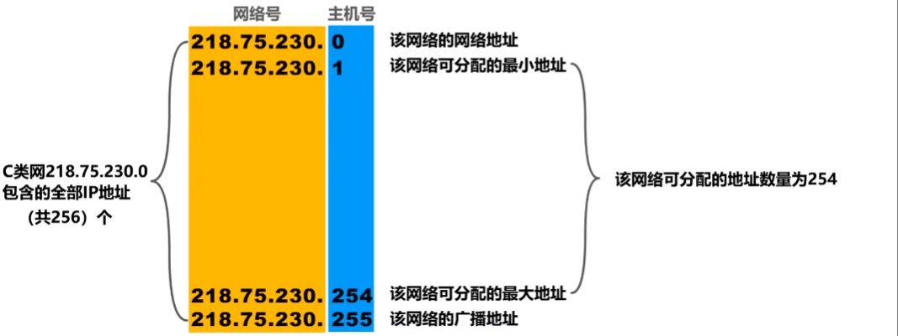

例题2

例题3

 

**默认子网掩码**

### 无分类编制

- 划分子网在一定程度上缓解了因特网在发展中遇到的困难，但是数量巨大的C类网因为其地址空间太小并没有得到充分使用，而因特网的IP地址仍在加速消耗，整个IPv4地址空间面临全部耗尽的威胁。
- 为此，因特网工程任务组IETF又提出了采用无分类编址的方法来解决IP地址紧张的问题，同时还专门成立IPv6工作组负责研究新版本lP以彻底解决IP地址耗尽问题。
- 1993年，IETF发布了无分类域间路由选择CIDR(Classless Inter-Domain Routing)的RFC文档:RFC 1517~1519和1520。
  - CIDR消除了传统的A类、B类和C类地址，以及划分子网的概念;
  - CIDR可以更加有效地分配IPv4的地址空间，并且可以在新的IPv6使用之前允许因特网的规模继续增长。

例题1

例题2

**路由聚合(超网）**

例题1

例题2

### 应用规划

**定长的子网掩码FLSM**

**变长的子网掩码VLSM**

## IP数据报的发送与转发

- 路由器收至到护P数据报后如何转发?
  - 检查IP数据报首部是否出错：若出错，则直接丢弃该lIP数据报并通告源主机若没有出错，则进行转发
  - 根据IP数据报的目的地址在路由表中查找匹配的条目:若找到匹配的条目，则转发给条目中指示的下一跳若找不到，则丢弃该IP数据报并通告源主机

例题1

例题2

例题3

## 静态路由配置&路由环路

- 静态路由配置是指用户或网络管理员使用路由器的相关命令给路由器人工配置路由表。
  - 这种人工配置方式简单、开销小。但不能及时适应网络状态（流量、拓扑等）的变化。
  - 一般只在小规模网络中采用。
- 使用静态路由配置可能出现以下导致产生路由环路的错误
  - 配置错误
  - 聚合了不存在的网络
  - 网络故障

默认路由

特定主机路由

PS：为特定路由是192.168.2.1/32，为什么是32呢？原因：相当于把这台主机看作成一个网络，他整个`192.168.2.1`就是一个网络号，没有主机号，因此是32

配置错误

聚合错误

网络故障

## 路由选择协议

- 静态路由
  - 由人工配置的网络路由、默认路由、特定主机路由、黑洞路由等都属于静态路由。
  - 这种人工配置方式简单、开销小。但不能及时适应网络状态（流量、拓扑等)的变化。
  - 一般只在小规模网络中采用。
- 动态路由
  - 路由器通过路由选择协议自动获取路由信息。
  - 比较复杂、开销比较大。能较好地适应网络状态的变化。
  - 适用于大规模网络。

- 因特网所采用的路由选择协议的主要特点
  - 自适应：动态路由选择，能较好地适应网络状态的变化
  - 分布式：路由器之间交换路由信息
  - 分层次：将整个因特网划分为许多较小的自治系统AS(Autonomous Syste

因特网采用分层次的路由选择协议

常见的路由选择协议

路由器的基本结构

- 路由表一般仅包含从目的网络到下一跳的映射
- 路由表需要对网络拓扑变化的计算最优化
- 转发表是从路由表得出的
- 转发表的结构应当使查找过程最优化

## 路由信息协议RIP

### RIP概述

- 路由信息协议RIP(Routing Information Protocol)是内部网关协议IGP中最先得到广泛使用的协议之一，其相关标准文档为RFC 1058。
- RIP要求自治系统AS内的每一个路由器都要维护从它自己到AS内其他每一个网络的距离记录。这是一组距离，称为“距离向量D-V(Distance-Vector)”。
- RIP使用跳数(Hop Count)作为度量(Metric)来衡量到达目的网络的距离。
  - 路由器到直连网络的距离定义为1。
  - 允许一条路径最多只能包含15个路由器。“距离”等于16时相当于不可达。
  - 因此,RIP只适用于小型互联网。

因此,RIP只适用于小型互联网。

- RIP包含三个要点
  - 和谁交换信息：仅和相邻路由器交换信息
  - 交换什么信息：自己的路由表
  - 何时交换信息：周期性交换（例如每30秒)

### 工作过程

例题

坏消息传播得慢

例题

## 开放最短路径优先OSPF

### 概述

- 开放最短路径优先OSPF(Open Shortest Path First)，是为克服RIP的缺点在1989年开发出来的。
  - “开放”表明OSPF协议不是受某一家厂商控制，而是公开发表的。
  - “最短路径优先”是因为使用了Dijkstra提出的最短路径算法SPF。
- OSPF是基于链路状态的，而不像RIP那样是基于距离向量的。
- OSPF采用SPF算法计算路由，从算法上保证了不会产生路由环路。
- OSPF不限制网络规模，更新效率高，收敛速度快。
- 链路状态是指本路由器都和哪些路由器相邻，以及相应链路的“代价”(cost)。
  - “代价”用来表示费用、距离、时延、带宽，等等。这些都由网络管理人员来决定。

- OSPF有以下五种分组类型
  - 类型1，问候(Hello)分组用来发现和维护邻居路由器的可达性。
  - 类型2，数据库描述(Database Description)分组向邻居路由器给出自己的链路状态数据库中的所有链路状态项目的摘要信息
  - 类型3，链路状态请求(Link State Request)分组向邻居路由器请求发送某些链路状态项目的详细信息。
  - 类型4，链路状态更新(Link State Update)分组，路由器使用这种分组将其链路状态进行洪泛发送，即用洪泛法对全网更新链路状态
  - 类型5，链路状态确认(Link State Acknowledgment)分组这是对链路状态更新分组的确认分组。

### 工作过程

## 边界网关协议BGP

- 自治系统之间的路由选择必须考虑相关策略（政治，经济，安全等)
- BGP只能是力求寻找一条能够到达目的网络且比较好的路由(不能兜圈子)，而并非要寻找一条最佳路由

BGP发言人

- 在配置BGP时，每个自治系统的管理员要选择至少一个路由器作为该自治系统的“BGP发言人"
- 不同自治系统的BGP发言人要交换路由信息，首先必须建立TCP连接，端口号为179
  - 在此TCP连接上交换BGP报文以建立BGP会话
  - 利用BGP会话交换路由信息（例如，增加新的路由，或撤销过时的路由，以及报告出错的情况等)
  - 使用TCP连接交换路由信息的两个BGP发言人，彼此称为对方的邻站(neighbor)或对等站(peer)
- BGP发言人除了运行BGP外，还必须运行自己所在自治系统所使用的内部网关协议IGP，例如OSPF或RIP。

- BGP-4有以下四种报文
  - OPEN(打开)报文:用来与相邻的另一个BGP发言人建立关系，使通信初始化。
  - UPDATE(更新)报文:用来通告某一路由的信息，以及列出要撤销的多条路由。
  - KEEPALIVE(保活)报文:用来周期性地证实邻站的连通性。
  - NOTIFICATION(通知)报文:用来发送检测到的差错。

例题1

例题2

## IPv4数据报的首部格式

### 格式

- 版本
  - 占4比特，表示lP协议的版本。
  - 通信双方使用的IP协议的版本必须一致。目前广泛使用的IP协议版本号为4(即IPv4)。
- 首部长度
  - 占4比特，表示lP数据报首部的长度。该字段的取值以4字节为单位。
  - 最小十进制取值为5，表示IP数据报首部只有20字节固定部分;
  - 最大十进制取值为15，表示IP数据报首部包含20字节固定部分和最大40字节可变部分。
- 可选字段
  - 长度从1个字节到40个字节不等。用来支持排错、测量及安全等措施。
  - 可选字段增加了IP数据报的功能，但这同时也使得IP数据报的首部长度成为可变的。这就增加了每一个路由器处理IP数据报的开销。实际上可选字段很少被使用。
- 填充字段
  - 确保首部长度为4字节的整数倍。使用全0进行填充。
- 区分服务
  - 占8比特，用来获得更好的服务。
  - 该字段在旧标准中叫作服务类型，但实际上一直没有被使用过。1998年，因特网工程任务组IETF把这个字段改名为区分服务。利用该字段的不同数值可提供不同等级的服务质量。
  - 只有在使用区分服务时，该字段才起作用。一般情况下都不使用该字段。
- 总长度
  - 占16比特，表示IP数据报的总长度（首部+数据载荷)。
  - 最大取值为十进制的65535，以字节为单位。

- 标识字段
  - 占16比特，属于同一个数据报的各分片数据报应该具有相同的标识。
  - IP软件维持一个计数器，每产生一个数据报，计数器值加1，并将此值赋给标识字段。
- 标志
  - 占3比特，各比特含义如下:
    - DF位:1表示不允许分片;0表示允许分片
    - MF位:1表示“后面还有分片”;0表示“这是最后一个分片”
    - 保留位:必须为0
- 片偏移
  - 占13比特，指出分片数据报的数据载荷部分偏移其在原数据报的位置有多少个单位。
  - 片偏移以8个字节为单位。

- 生存时间TTL
  - 占8比特，最初以秒为单位，最大生存周期为255秒;路由器转发IP数据报时，将IP数据报首部中的该字段的值减去lIP数据报在本路由器上所耗费的时间，若不为0就转发，否则就丢弃。
  - 现在以“跳数”为单位，路由器转发IP数据报时，将IP数据报首部中的该字段的值减1，若不为0就转发，否则就丢弃。
- 协议
  - 占8比特，指明IPv4数据报的数据部分是何种协议数据单元。常用的一些协议和相应的协议字段值如下。
    - ICMP：1
    - IGMP：2
    - TCP：6
    - UDP：17
    - IPv6：41
    - OSPF：89
- 首部检验和
  - 占16比特，用来检测首部在传输过程中是否出现差错。比CRC检验码简单，称为因特网检验和。
  - IP数据报每经过一个路由器，路由器都要重新计算首部检验和，因为某些字段（生存时间、标志、片偏移等)的取值可能发生变化。
  - 由于IP层本身并不提供可靠传输的服务，并且计算首部校验和是一项耗时的操作，因此在IPv6中，路由器不再计算首部校验和，从而更快转发IP数据报。
- 源IP地址、目的IP地址
  - 各占32比特，用来填写发送该IP数据报的源主机的IP地址和接收该IP数据报的目的主机的IP地址。

### 分片

进一步分片

### 生存时间

生存时间TTL字段的作用——防止IP数据报在网络中永久兜圈

### 例题

1

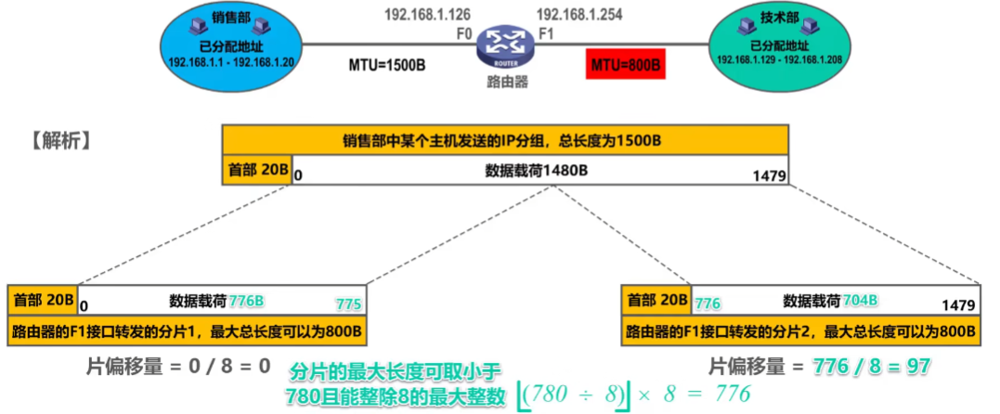

2

## 网际控制报文协议ICMP

- 为了更有效地转发lP数据报和提高交付成功的机会，在网际层使用了网际控制报文协议ICMP(Internet Control Message Protocol)。
- 主机或路由器使用ICMP来发送差错报告报文和询问报文。
- ICMP报文被封装在IP数据报中发送。

### 5种报告

ICMP差错报告报文共有以下五种：

- 终点不可达：当路由器或主机不能交付数据报时，就向源点发送终点不可达报文。具体可再根据ICMP的代码字段细分为目的网络不可达目的主机不可达、目的协议不可达、目的端口不可达、目的网络未知、目的主机未知等13种错误。

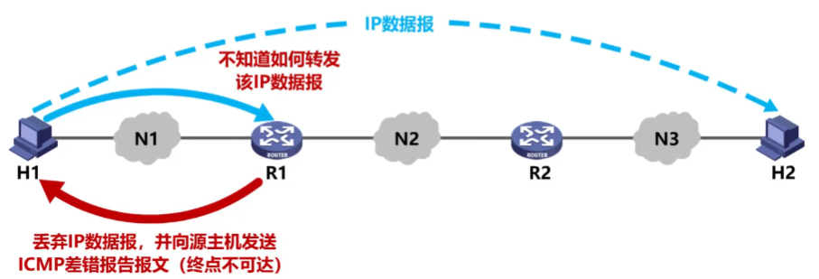

- 源点抑制：当路由器或主机由于拥塞而丢弃数据报时，就向源点发送源点抑制报文，使源点知道应当把数据报的发送速率放慢。

- 时间超过：当路由器收到一个目的IP地址不是自己的IP数据报，会将其生存时间TTL字段的值减1。若结果不为0，则将该IP数据报转发出去;若结果为0，除丢弃该IP数据报外，还要向源点发送时间超过报文。另外，当终点在预先规定的时间内不能收到一个数据报的全部数据报片时，就把已收到的数据报片都丢弃，也会向源点发送时间超过报文。

- 参数问题：当路由器或目的主机收到P数据报后，根据其首部中的检验和字段发现首部在传输过程中出现了误码，就丢弃该数据报，并向源点发送参数问题报文。

- 改变路由(重定向)：路由器把改变路由报文发送给主机，让主机知道下次应将数据报发送给另外的路由器（可通过更好的路由)。

以下情况不应发送ICMP差错报告报文:

1. 对ICMP差错报告报文不再发送ICMP差错报告报文
2. 对ICMP差错报告报文不再发送ICMP差错报告报文
3. 对第一个分片的数据报片的所有后续数据报片都不发送ICMP差错报告报文
4. 对具有多播地址的数据报都不发送ICMP差错报告报文
5. 对具有特殊地址(如127.0.0.0或0.0.0.0)的数据报不发送ICMP差错报告报文

### 例题

### 常用的ICMP询问报文

- 回送请求和回答
  - ICMP回送请求报文是由主机或路由器向一个特定的目的主机发出的询问。收到此报文的主机必须给源主机或路由器发送ICMP回送回答报文。
  - 这种询问报文用来测试目的站是否可达及了解其有关状态。
- 时间戳请求和回答
  - ICMP时间戳请求报文是请某个主机或路由器回答当前的日期和时间。
  - 在ICMP时间戳回答报文中有一个32位的字段，其中写入的整数代表从1900年1月1日起到当前时刻一共有多少秒。
  - 这种询问报文用来进行时钟同步和测量时间。

### 应用

- 分组网间探测PING(Packet InterNet Groper)
  - 用来测试主机或路由器间的连通性
  - 应用层直接使用网际层的ICMP(没有通过运输层的TCP或UDP)
  - 使用ICMP回送请求和回答报文

- 跟踪路由（traceroute）
  - 用来测试IP数据报从源主机到达目的主机要经过哪些路由器
  - Windows版本
    - tracert命令
    - 应用层直接使用网际层ICMP
    - 使用了ICMP回送请求和回答报文以及差错报告报文
  - Unix版本
    - traceroute命令
    - 在运输层使用UDP协议
    - 仅使用ICMP差错报告报文

跟踪路由过程

## VPN和NAT

- VPN
  - 利用公用的因特网作为本机构各专用网之间的通信载体，这样的专用网又称为虚拟专用网。由于IPv4地址的紧缺，一个机构能够申请到的IPv4地址数量往往远小于本机构所拥有的主机数量。因此，虚拟专用网中的各主机所分配的地址应该是本机构可自由分配的专用地址,而不是需要申请的、在因特网上使用的公有地址。
  - 私有地址只能用于一个机构的内部通信
  - 如下图所示，同一机构内不同部门的内部网络所构成的虚拟专用网VPN又称为内联网VPN。
  - 有时一个机构的VPN需要有某些外部机构（通常就是合作伙伴）参加进来。这样的VPN就称为外联网VPN,在外地工作的员工需要访问公司内部的专用网络时，只要在任何地点接入到因特网，运行驻留在员工PC中的VPN软件，在员工的PC和公司的主机之间建立VPN隧道，即可访问专用网络中的资源。这种VPN称为远程接入VPN。

- NAT
  - 虽然因特网采用了无分类编址方式来减缓lPv4地址空间耗尽的速度，但由于因特网用户数目的激增，特别是大量小型办公室网络和家庭网络接入因特网的需求不断增加，IPv4地址空间即将面临耗尽的危险仍然没有被解除。
  - 1994年提出了一种网络地址转换NAT的方法再次缓解了IPv4地址空间即将耗尽的问题。
  - NAT能使大量使用内部专用地址的专用网络用户共享少量外部全球地址来访问因特网上的主机和资源。

由于绝大多数的网络应用都是使用运输层协议TCP或UDP来传送数据，因此可以利用运输层的端口号和IP地址一起进行转换。这样，用一个全球IP地址就可以使多个拥有本地地址的主机同时和因特网上的主机进行通信。这种将端口号和IP地址一起进行转换的技术叫作网络地址与端口号转换NAPT(Network Address and Port Translation)。

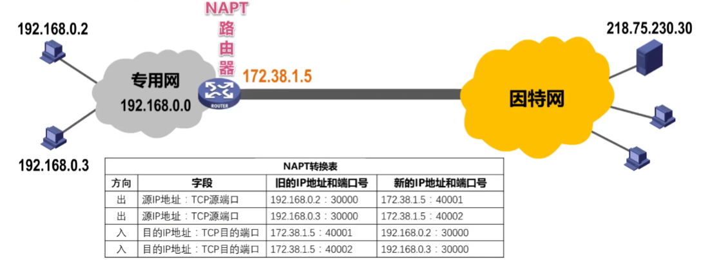

外网主机不可以首先发起和私有地址的通信，私有地址主机不可以直接充当因特网服务器

对于一些P2P网络应用，需要外网主机主动与内网主机进行通信,在通过NAT时会遇到问题，需要网络应用自己使用一些特殊的NAT穿越技术来解决问题。

另外，由于NAT对外网屏蔽了内网主机的网络地址，能为内网的主机提供一定的安全保护。

# 运输层

## 端口号&复用&分用

- 运行在计算机上的进程使用进程标识符PID来标志。
- 因特网上的计算机并不是使用统一的操作系统，不同的操作系统(windows，Linux，Mac OS)又使用不同格式的进程标识符。

- 为了使运行不同操作系统的计算机的应用进程之间能够进行网络通信，就必须使用统一的方法对TCP/IP体系的应用进程进行标识。

- TCP/IP体系的运输层使用端口号来区分应用层的不同应用进程。
  - 端口号使用16比特表示，取值范围0~65535;
  - 熟知端口号:0~1023，IANA把这些端口号指派给了TCP/IP体系中最重要的一些应用协议，例如:FTP使用21/20，HTTP使用80，DNS使用53。
  - 登记端口号:1024~49151，为没有熟知端口号的应用程序使用。使用这类端口号必须在IANA按照规定的手续登记，以防止重复。例如:Microsoft RDP微软远程桌面使用的端口是3389。
  - 短暂端口号:49152~65535，留给客户进程选择暂时使用。当服务器进程收到客户进程的报文时，就知道了客户进程所使用的动态端口号。通信结束后，这个端口号可供其他客户进程以后使用。

- 端口号只具有本地意义，即端口号只是为了标识本计算机应用层中的各进程，在因特网中，不同计算机中的相同端口号是没有联系的。

- 发送方的复用和接收方的分用

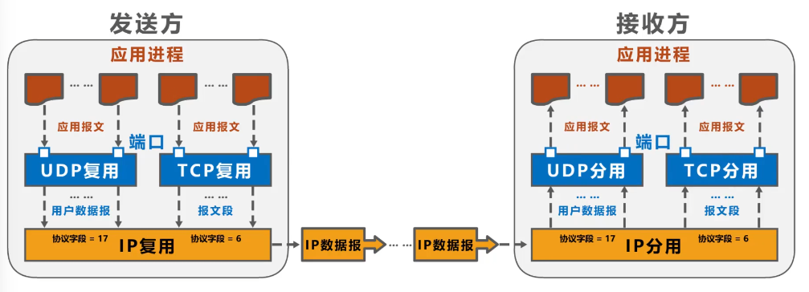

- TCP/IP体系的应用层常用协议所使用的运输层熟知端口号

## UDP和TCP对比

## TCP

### 流量控制

- 一般来说，我们总是希望数据传输得更快一些。但如果发送方把数据发送得过快，接收方就可能来不及接收，这就会造成数据的丢失。
- 所谓流量控制(flow control)就是让发送方的发送速率不要太快，要让接收方来得及接收。
- 利用滑动窗口机制可以很方便地在TCP连接上实现对发送方的流量控制。

即使接收窗口为0，也必须接收零窗口接收报文段、确认报文段、携带有紧急数据的报文段

例题

### 拥塞控制

- 在某段时间，若对网络中某一资源的需求超过了该资源所能提供的可用部分，网络性能就要变坏。这种情况就叫做拥塞(congestion)。在计算机网络中的链路容量（即带宽)、交换结点中的缓存和处理机等，都是网络的资源。
- 若出现拥塞而不进行控制，整个网络的吞吐量将随输入负荷的增大而下降。

> 下面，我们假设
>
> (1)数据是单方向传送，而另一个方向只传送确认。
>
> (2)接收方总是有足够大的缓存空间，因而发送方发送窗口的大小由网络的拥塞程度来决定。
>
> (3)以最大报文段MSS的个数为讨论问题的单位，而不是以字节为单位。

**慢开始(slow-start)**

**拥塞避免(congestion avoidance)**

**快重传(fast retransmit)**

- 慢开始和拥塞避免算法是1988年提出的TCP拥塞控制算法（TCP Tahoe版本)。
- 1990年又增加了两个新的拥塞控制算法(改进TCP的性能)，这就是快重传和快恢复（TCP Reno版本)。
  - 有时，个别报文段会在网络中丢失，但实际上网络并未发生拥塞。
  - 这将导致发送方超时重传，并误认为网络发生了拥塞;
  - 发送方把拥塞窗口cwnd又设置为最小值1，并错误地启动慢开始算法，因而降低了传输效率。
- 采用快重传算法可以让发送方尽早知道发生了个别报文段的丢失。
- 所谓快重传，就是使发送方尽快进行重传，而不是等超时重传计时器超时再重传。
  - 要求接收方不要等待自己发送数据时才进行捎带确认，而是要立即发送确认;
  - 即使收到了失序的报文段也要立即发出对已收到的报文段的重复确认。
  - 发送方一旦收到3个连续的重复确认，就将相应的报文段立即重传，而不是等该报文段的超时重传计时器超时再重传。

**快恢复(fast recovery)**

- 发送方一旦收到3个重复确认，就知道现在只是丢失了个别的报文段。于是不启动慢开始算法，而执行快恢复算法;
  - 发送方将慢开始门限ssthresh值和拥塞窗口cwnd值调整为当前窗口的一半;开始执行拥塞避免算法。
  - 也有的快恢复实现是把快恢复开始时的拥塞窗口cwnd值再增大一些，即等于新的ssthresh + 3。
    - 既然发送方收到3个重复的确认，就表明有3个数据报文段已经离开了网络;
    - 这3个报文段不再消耗网络资源而是停留在接收方的接收缓存中;
    - 可见现在网络中不是堆积了报文段而是减少了3个报文段。因此可以适当把拥塞窗口扩大些。

例题

### 超时重传时间的选择

### 可靠传输

 

- 虽然发送方的发送窗口是根据接收方的接收窗口设置的，但在同一时刻，发送方的发送窗口并不总是和接收方的接收窗口一样大。
  - 网络传送窗口值需要经历一定的时间滞后，并且这个时间还是不确定的。
  - 发送方还可能根据网络当时的拥塞情况适当减小自己的发送窗口尺寸。
- 对于不按序到达的数据应如何处理，TCP并无明确规定。
  - 如果接收方把不按序到达的数据一律丢弃，那么接收窗口的管理将会比较简单，但这样做对网络资源的利用不利,因为发送方会重复传送较多的数据。
  - TCP通常对不按序到达的数据是先临时存放在接收窗口中，等到字节流中所缺少的字节收到后，再按序交付上层的应用进程。
- TCP要求接收方必须有累积确认和捎带确认机制，这样可以减小传输开销。接收方可以在合适的时候发送确认，也可以在自己有数据要发送时把确认信息顺便捎带上。
  - 接收方不应过分推迟发送确认，否则会导致发送方不必要的超时重传，这反而浪费了网络的资源。TCP标准规定，确认推迟的时间不应超过0.5秒。若收到一连串具有最大长度的报文段，则必须每隔一个报文段就发送一个确认[RFC 1122]。
  - 捎带确认实际上并不经常发生，因为大多数应用程序很少同时在两个方向上发送数据。
- TCP的通信是全双工通信。通信中的每一方都在发送和接收报文段。因此，每一方都有自己的发送窗口和接收窗口。在谈到这些窗口时，一定要弄清楚是哪一方的窗口。

例题1

例题2

### 运输连接管理

#### 连接建立

- TCP的连接建立要解决以下三个问题
  - 使TCP双方能够确知对方的存在
  - 使TCP双方能够协商一些参数(如最大窗口值、是否使用窗口扩大选项和时间戳选项以及服务质量等)
  - 使TCP双方能够对运输实体资源（如缓存大小、连接表中的项目等）进行分配。
- 传输控制块
  - 指向发送和接收缓存的指针
  - 指向重传队列的指针
  - 当前的发送和接收序号

第三次握手是否多余？不多余!这是为了防止已失效的连接请求报文段突然又传送到了TCP服务器，因而导致错误。

如果改成两次握手

例题

#### 连接释放

### 首部格式

- 为了实现可靠传输，TCP采用了面向字节流的方式。
- 但TCP在发送数据时，是从发送缓存取出一部分或全部字节并给其添加一个首部使之成为TCP报文段后进行发送。
  - 一个TCP报文段由首部和数据载荷两部分构成;
  - TCP的全部功能都体现在它首部中各字段的作用。

- 源端口:占16比特，写入源端口号，用来标识发送该TCP报文段的应用进程。
- 目的端口:占16比特，写入目的端口号，用来标识接收该TCP报文段的应用进程。

- 序号
  - 占32比特，取值范围[0，2”-1]，序号增加到最后一个后，下一个序号就又回到0。
  - 指出本TCP报文段数据载荷的第一个字节的序号。

- 确认号
  - 占32比特，取值范围[0,2”-1]，确认号增加到最后一个后，下一个确认号就又回到0。
  - 指出期望收到对方下一个TCP报文段的数据载荷的第一个字节的序号，同时也是对之前收到的所有数据
  - 若确认号=n，则表明到序号n-1为止的所有数据都已正确接收，期望接收序号为n的数据。

- 确认标志位ACK
  - 取值为1时确认号字段才有效;取值为0时确认号字段无效。
  - TCP规定，在连接建立后所有传送的TCP报文段都必须把ACK置1。

- 数据偏移
  - 占4比特，并以4字节为单位。用来指出TCP报文段的数据载荷部分的起始处距离TCP报文段的起始处有多远。
  - 这个字段实际上是指出了TCP报文段的首部长度。下面的结果单位是4字节
    - 首部固定长度为20字节，因此数据偏移字段的最小值为(B0101)
    - 首部最大长度为60字节，因此数据偏移字段的最大值为(B1111)

- 保留:占6比特，保留为今后使用，但目前应置为0。

- 窗口
  - 占16比特，以字节为单位。指出发送本报文段的一方的接收窗口。
  - 窗口值作为接收方让发送方设置其发送窗口的依据。
  - 这是以接收方的接收能力来控制发送方的发送能力,称为流量控制。

- 校验和
  - 占16比特，检查范围包括TCP报文段的首部和数据载荷两部分。
  - 在计算校验和时，要在TCP报文段的前面加上12字节的伪首部。

- 同步标志位SYN:在TCP连接建立时用来同步序号。

- 终止标志位FIN:用来释放TCP连接。

- 复位标志位RST
  - 用来复位TCP连接。
  - 当RST=1时,表明TCP连接出现了异常，必须释放连接，然后再重新建立连接。
  - RST置1还用来拒绝一个非法的报文段或拒绝打开一个TCP连接。

- 推送标志位PSH:接收方的TCP收到该标志位为1的报文段会尽快上交应用进程，而不必等到接收缓存都填满后再向上交付。

- 紧急标志位URG
  - 占16比特，以字节为单位，用来指明紧急数据的长度。
  - 取值为1时紧急指针字段有效;取值为0时紧急指针字段无效。
  - 当发送方有紧急数据时，可将紧急数据插队到发送缓存的最前面，并立刻封装到一个TCP报文段中进行发送。紧急指针会指出本报文段数据载荷部分包含了多长的紧急数据，紧急数据之后是普通数据。

- 选项
  - 最大报文段长度MSS选项:TCP报文段数据载荷部分的最大长度。
  - 窗口扩大选项:为了扩大窗口(提高吞吐率)。
  - 时间戳选项:用来计算往返时间RTT，用于处理序号超范围的情况，又称为防止序号绕回PAWS。
  - 选择确认选项

- 填充
  - 由于选项的长度可变，因此使用填充来确保报文段首部能被4整除(因为数据偏移字段，也就是首部长度字段，是以4字节为单位的)。

# 应用层

- 应用层是计算机网络体系结构的最顶层，是设计和建立计算机网络的最终目的，也是计算机网络中发展最快的部分。
  - 早期基于文本的应用（电子邮件、远程登录、文件传输、新闻组)
  - 20世纪90年代将因特网带入千家万户的万维网www
  - 当今流行的即时通信、P2P文件共享及各种音视频应用
  - 计算设备的小型化和“无处不在”，宽带住宅接入和无线接入的日益普及和迅速发展，为未来更多的新型应用提供了广阔的舞台。
- 在本章中，我们以一些经典的网络应用为例来学习有关网络应用的原理、协议和实现方面的知识。

## CS模式和对等模式

- 网络应用程序运行在处于网络边缘的不同的端系统上，通过彼此间的通信来共同完成某项任务。
- 开发一种新的网络应用首先要考虑的问题就是网络应用程序在各种端系统上的组织方式和它们之间的关系。目前流行的主要有以下两种:
  - 客户/服务器(Client/Server，C/S)方式
  - 对等(Peer-to-Peer，P2P)方式

### CS

- 客户/服务器(Client/Server，C/S)方式
  - 客户和服务器是指通信中所涉及的两个应用进程。
  - 客户/服务器方式所描述的是进程之间服务和被服务的关系。
  - 客户是服务请求方，服务器是服务提供方。
  - 服务器总是处于运行状态，并等待客户的服务请求。服务器具有固定端口号（例如HTTP服务器的默认端口号为80)，而运行服务器的主机也具有固定的IP地址。

- C/S方式是因特网上传统的、同时也是最成熟的方式，很多我们熟悉的网络应用采用的都是C/S方式。包括万维网www、电子邮件、文件传输FTP等。

- 基于C/S方式的应用服务通常是服务集中型的，即应用服务集中在网络中比客户计算机少得多的服务器计算机上。
  - 由于一台服务器计算机要为多个客户机提供服务，在C/S应用中，常会出现服务器计算机跟不上众多客户机请求的情况。
  - 为此，在C/S应用中，常用计算机群集（或服务器场）构建一个强大的虚拟服务器。

### P2P

- 对等(Peer-to-Peer，P2P)方式
  - 在P2P方式中，没有固定的服务请求者和服务提供者，分布在网络边缘各端系统中的应用进程是对等的，被称为对等方。对等方相互之间直接通信，每个对等方既是服务的请求者，又是服务的提供者
- 目前，在因特网上流行的P2P应用主要包括P2P文件共享、即时通信、P2P流媒体、分布式存储等。
- 基于P2P的应用是服务分散型的，因为服务不是集中在少数几个服务器计算机中，而是分散在大量对等计算机中，这些计算机并不为服务提供商所有，而是为个人控制的桌面计算机和笔记本电脑，它们通常位于住宅、校园和办公室中。

- P2P方式的最突出特性之一就是它的可扩展性。因为系统每增加一个对等方，不仅增加的是服务的请求者，同时也增加了服务的提供者，系统性能不会因规模的增大而降低。

- P2P方式具有成本上的优势，因为它通常不需要庞大的服务器设施和服务器带宽。为了降低成本，服务提供商对于将P2P方式用于应用的兴趣越来越大。

## 动态主机配置协议DHCP

## DNS

例题1 

例题2

## 文件传送协议FTP

- 将某台计算机中的文件通过网络传送到可能相距很远的另一台计算机中，是一项基本的网络应用，即文件传送。
- 文件传送协议FTP(File Transfer Protocol）是因特网上使用得最广泛的文件传送协议。
  - FTP提供交互式的访问，允许客户指明文件的类型与格式(如指明是否使用ASCII码)，并允许文件具有存取权限（如访问文件的用户必须经过授权，并输入有效的口令)。
  - FTP屏蔽了各计算机系统的细节，因而适合于在异构网络中任意计算机之间传送文件。

- 在因特网发展的早期阶段，用FTP传送文件约占整个因特网的通信量的三分之一，而由电子邮件和域名系统所产生的通信量还要小于FTP所产生的通信量。只是到了1995年，万维网WWW的通信量才首次超过了FTP。

例题1

例题2

## 电子邮件

- SMTP协议只能传送ASCII码文本数据，不能传送可
- SMTP不能满足传送多媒体邮件（例如带有图片、音频或视频数据）的需要。并且许多其他非英语国家的文字(例如中文、俄文、甚至带有重音符号的法文或德文)也无法用SMTP传送。执行文件或其他的二进制对象。
- 为解决SMTP传送非ASCII码文本的问题，提出了多用途因特网邮件扩展MIME(Multipurpose Internet Mail Extensions)
  - 增加了5个新的邮件首部字段，这些字段提供了有关邮件主体的信息。
  - 定义了许多邮件内容的格式，对多媒体电子邮件的表示方法进行了标准化。
  - 定义了传送编码，可对任何内容格式进行转换，而不会被邮件系统改变。
- 实际上，MIME不仅仅用于SMTP，也用于后来的同样面向ASCII字符的HTTP。

- 常用的邮件读取协议有以下两个:
  - 邮局协议POP (Post Office Protocol)，POP3是其第三个版本，是因特网正式标准。非常简单、功能有限的邮件读取协议。用户只能以下载并删除方式或下载并保留方式从邮件服务器下载邮件到用户方计算机。不允许用户在邮件服务器上管理自己的邮件。(例如创建文件夹，对邮件进行分类管理等)。
  - 因特网邮件访问协议IMAP (Internet Message Access Protocol)，IMAP4是其第四个版本，目前还只是因特网建议标准。功能比POP3强大的邮件读取协议。用户在自己的计算机上就可以操控邮件服务器中的邮箱，就像在本地操控━样，因此IMAP是一个联机协议。
  - POP3和IMAP4都采用基于TCP连接的客户/服务器方式。POP3使用熟知端口110，IMAP4使用熟知端口143。

例题1

例题2：7bit是ASCII的定语，因为ASCII是7bit也只有7bit

例题3

## 万维网WWW

-  HTTP/1.0采用非持续连接方式。在该方式下，每次浏览器要请求一个文件都要与服务器建立TCP连接当收到响应后就立即关闭连接。
  - 每请求一个文档就要有两倍的RTT的开销。若一个网页上有很多引用对象（例如图片等)，那么请求每一个对象都需要花费2RTT的时间。
  - 为了减小时延，浏览器通常会建立多个并行的TCP连接同时请求多个对象。但是，这会大量占用万维网服务器的资源，特别是万维网服务器往往要同时服务于大量客户的请求，这会使其负担很重。
- HTTP/1.1采用持续连接方式。在该方式下，万维网服务器在发送响应后仍然保持这条连接，使同一个客户(浏览器）和该服务器可以继续在这条连接上传送后续的HTTP请求报文和响应报文。这并不局限于传送同一个页面上引用的对象，而是只要这些文档都在同一个服务器上就行。
  - 为了进一步提高效率，HTTP/1.1的持续连接还可以使用流水线方式工作，即浏览器在收到HTTP的响应报文之前就能够连续发送多个请求报文。这样的一个接一个的请求报文到达服务器后，服务器就发回一个接一个的响应报文。这样就节省了很多个RTT时间，使TCP连接中的空闲时间减少,提高了下载文档的效率。

- 使用Cookie在服务器上记录用户信息

  - 早期的万维网应用非常简单，仅仅是用户查看存放在不同服务器上的各种静态的文档。因此HTTP被设计为—种无状态的协议。这样可以简化服务器的设计。

  - 现在，用户可以通过万维网实现各种复杂的应用，如网上购物、电子商务等。这些应用往往需要万维网服务器能够识别用户。

  - Cookie提供了一种机制使得万维网服务器能够“记住”用户，而无需用户主动提供用户标识信息。也就是说，Cookie是一种对无状态的HTTP进行状态化的技术。

例题1

例题2

